# A detailed analysis of Tydi-Chisel representations in testing frameworks
This section proposes an analysis of how specific elements of Tydi-Chisel are represented in different testing frameworks. 
This section aims to identify the weaknesses in the current representations with particular focus on the **mismatch** between the Chisel **source code** and the testing **framework representation**. Namely, what the designer writes in Chisel and Tydi and what they see in the testing framework.

> **Note:** A more general analysis about each testing frameworks is provided in each respective directory in [results](/results).

> **Note:** Source code of the examples is available in the [examples](../../examples/) directory.

- [A detailed analysis of Tydi-Chisel representations in testing frameworks](#a-detailed-analysis-of-tydi-chisel-representations-in-testing-frameworks)
  - [1. Adder: a parametrized module that uses `Bundle`/`Vec` and `Array` to group signals and instantiate multiple modules](#1-adder-a-parametrized-module-that-uses-bundlevec-and-array-to-group-signals-and-instantiate-multiple-modules)
    - [1.1. Adder in waveforms](#11-adder-in-waveforms)
    - [1.2. Adder in HGDB](#12-adder-in-hgdb)
  - [2. DetectTwoOnes: a simple finite state machine that uses `ChiselEnum` to represent the states](#2-detecttwoones-a-simple-finite-state-machine-that-uses-chiselenum-to-represent-the-states)
    - [2.1. DetectTwoOnes in waveforms](#21-detecttwoones-in-waveforms)
    - [2.2. DetectTwoOnes in HGDB](#22-detecttwoones-in-hgdb)
  - [Parity: using `Enum` instead of `ChiselEnum`](#parity-using-enum-instead-of-chiselenum)
  - [Functionality: assign values to wires through different methods](#functionality-assign-values-to-wires-through-different-methods)
  - [Memory: a simple memory module that wraps the `Mem` chisel module](#memory-a-simple-memory-module-that-wraps-the-mem-chisel-module)
  - [Router: using chisel "typed" abstraction to represent circtuit components and characteristics](#router-using-chisel-typed-abstraction-to-represent-circtuit-components-and-characteristics)
- [References](#references)


## 1. Adder: a parametrized module that uses `Bundle`/`Vec` and `Array` to group signals and instantiate multiple modules
Chisel provides the `Bundle` and `Vec`[^1] classes to group signals together of different and same type respectively. 
Their elements can be accessed as named fields for `Bundle` and as indexed elements for `Vec`, similar to software `struct`/`class` and `array`.

In the chosen example, the `Adder` module uses such classes to group together the signals needed for the internal `carry`, `sum` and `IO` interface.

```scala
// IO interface
val io = IO(new Bundle {
    val A = Input(UInt(n.W))
    val B = Input(UInt(n.W))
    val Cin = Input(UInt(1.W))
    
    val Sum = Output(UInt(n.W))
    val Cout = Output(UInt(1.W))
})
// ...
// Internal carry and sum signals
val carry = Wire(Vec(n + 1, UInt(1.W)))
val sum = Wire(Vec(n, Bool()))
// ... 
```

A simpler carry propagate `Adder` consists of a concatenation of `FullAdder` modules. 
Those are instantiated using an `Array` of `FullAdder` chisel modules. 
This allows to write a single line of code to instantiate n-full adders.

```scala
// ...
// Carry propagate adder
val FAs = Array.fill(n)(Module(new FullAdder()))
// ...
```
Since Chisel is built on top of the scala language, its constructs can be used to manipulate the Chisel elements.
Bundle, Vec and Array can be simply accessed in the code as named fields and indexed elements. 
This is shown in the following code snippet. 
Moreover, for loops and integer variables can be used to iterate over arrays and vectors.

```scala
  // ...
  carry(0) := io.Cin // accessing and assigning a vector element through indexing
  // ...
  for (i <- 0 until n) { // use for loop to iterate over arrays
    // ...
    FAs(i).io.cin := carry(i) // indexing an array of modules and accessing its named fields
    carry(i + 1) := FAs(i).io.cout
    sum(i) := FAs(i).io.sum.asBool
  }
  // ...
  io.Sum := sum.asUInt
  io.Cout := carry(n) // use parametrized integer variable to access vector element
```

The previous code snippets illustrate how a developer can declare, access, and manipulate `Bundle`, `Vec`, and `Array`. 
These basic constructs arise the abstraction level when compared to low-level HDLs and allow to orgnaize the code in a more structured and concise format.
In languages like Verilog, concepts similar to `Bundle` and `Array` of modules do not exist, despite the presence of bit vectors and arrays of bits (`Vec`).

### 1.1. Adder in waveforms

Fig. 1 shows a bundle representation in waveforms.
In contrast to its chisel access. Its elements are not grouped by default under an `io` group and they are not represented as named fields. 
Yet, they are drawn as separate parallel signals and the parent bundle name can be retrieved from the signal name convention (`bundleName_signalName`). 

| 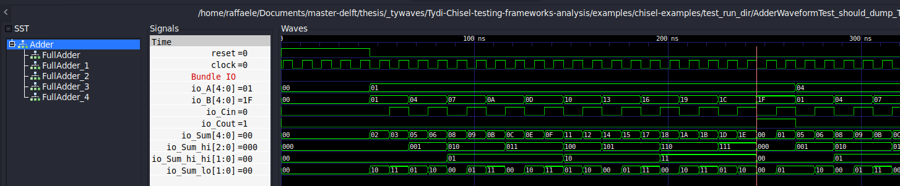                  |
| -------------------------------------------------------------------- |
| Fig. 1 - *A Chisel `Bundle` to group IO signals in waveform viewers* |

Similarly to bundles, also the waveform representation of vec does not match the code structure as it can be inspected in fig. 2. 
Indeed, vector elements are not grouped and displayed as indexed arrays, but they are represented as separate parallel signals.
Similarly to bundle the actual chisel `val` can be retrived from the signal name followed by an underscore and index (`name_i`).
Using `UInt(n.W)` instead of `Vec(n, UInt(1.W))` produces a different waveform representation more similar to a vector (see io_A in fig. 3). 
However, `UInt` cannot be indexed in chisel.
Hence, it is not possible to access individual bits of a `val carry = Wire(UInt((n+1).W))` in the same way as `val carry = Wire(Vec(n + 1, UInt(1.W))))`.

| 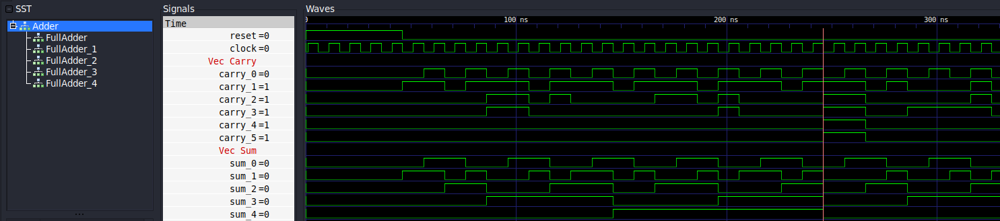                      |
| ----------------------------------------------------------------------- |
| Fig. 2 - *A Chisel `Vec` to represent a bit vector in waveform viewers* |

Finally, the waveform representation of an array of modules is shown in fig. 3.
Comparatively to the previous cases, an array of modules kinda maintains the structure of the chisel code, since a sub-module is instantiated for each element (`FullAdder_i` in the example).
At the same time, they do not reflect that those FullAdders are grouped together in an array.

| 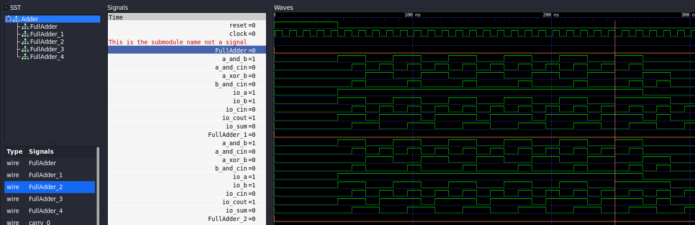     |
| ------------------------------------------------------------------------ |
| Fig. 3 - *A scala `Array` to instantiate multiple sub-modules in chisel* |

To test the robustness of this representation with this naming convention, I updated the code above by adding new `val` signals with the names that `io.A` and `sum(2)` have in fig. 1 and 2, namely `io_A` and `sum_2`.
This change does not affect behaviour of the previous logic. 
It does not raise issues while accessing the old signals since in Chisel:
```scala
  // These val are different: io.A is not io_A
  val io = IO(new Bundle {
    val A = Input(UInt(n.W))
  })
  val io_A = Wire(UInt(n.W))
  
  // Same for sum: sum(2) is not sum_2
  val sum = Wire(Vec(n, Bool()))
  val sum_2 = Wire(Vec(n, UInt(1.W)))
```
However, this update raises issues while inspecting signal names from waveform viewers due to the naming convention used in the translation to FIRRTL.
After I run the simulation with this new signals, such a simple addition to the code surprisingly affected the waveform signal names, despite the fact that the rest of chisel code is untouched.
The signal (`val sum`) changed name in the viewer as shown in fig. 4. 
Since its original name is now not present anymore, the signal disappeared from the waveform viewer. 
Specifically, the old `sum_i` (`sum(i)` in chisel) is renamed to `sum__i`, it conflicted with the `val sum_2` in the FIRRTL representation.
This affected `io_A` in a similar manner.
As a consequence, FIRRTL naming convention makes more difficult to understand which names indicate which `val` in chisel code, leading to a naming "overlap" which is not present in the chisel code.

| 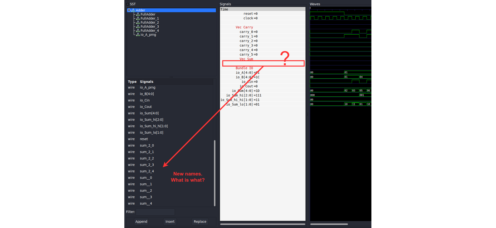                                                |
| ---------------------------------------------------------------------------------------------------------------------------------- |
| Fig. 4 - *Some signal names in chisel causes name conflicts in the FIRRTL representation which may lead to confusion in waveforms* |

The code snippet below and fig. 5 provide another example of naming issues. Here, a new wire named `FullAdder` and a module `FullAdder_5` are declared.
From fig. 5 it is counterintuitive to understand wether the `FullAdder` is used for the module `FAs(0)` or for the wire `FullAdder`. Similarly, it is impossible to establish if `FullAdder_5` is whether the 5th element of the array `FAs` or just a separate module `FullAdder_5`.

Going more in depth, this example shows additional problems:
- the name `FullAdder_5` in waveforms corresponds (incorrectly) to `FullAdder` in chisel
- `FullAdder_5_1` is related to the `FullAdder_5` module

<!-- This method that maps sub-elements of `Bundle`, `Vec` and `Array` to names followed by underscore and index/field name is  -->

```scala
// ...
// Carry propagate adder
val FAs = Array.fill(n)(Module(new FullAdder()))
val FullAdder = Wire(UInt(2.W))
val FullAdder_5 = Module(new FullAdder())
// ...
```

| 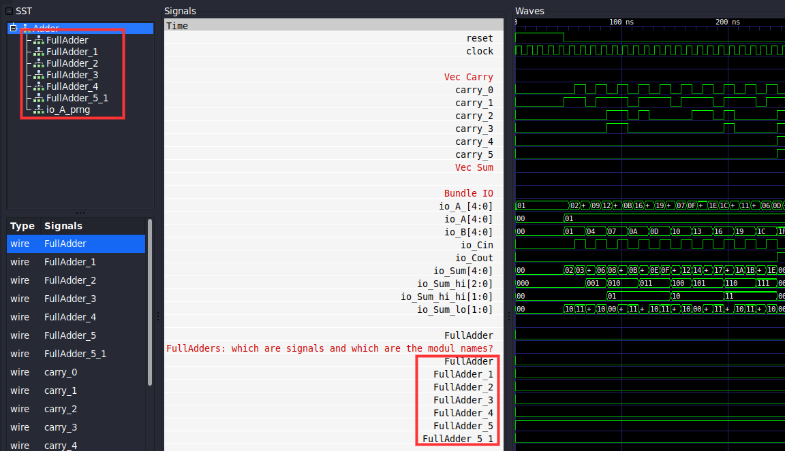           |
| --------------------------------------------------------------------------------------------- |
| Fig. 5 - *Another example in which some signal names in chisel causes confusion in waveforms* |

### 1.2. Adder in HGDB

In `Adder` simulated by Icarus (fig. 6.1 and 6.2):
- Elements of a bundle are grouped under the bundle name (i.e. `io`) and shown as named fields.
- Vec elements are grouped as an array of signals, however it still has some issues. Using Carry as example:
  - It is shown to be an array (even though it is more properly a Vec in chisel)
  - It has an overcomplicated structure. Carry is simply a Vector of UInts, but it can be seen (from the debugger) that it has clock, dumpfile etc. and aslo references to io signals.
  - Inspect its values is not possible. As shown in fig. 6.1, an Error value is displayed.
  - Similar results for `sum` 
- However another vector is shown properly (`sum_2`), it is correctly represented as an array (even though it is actually a Vec) of UInts. Integer values are shown instead of not Error.
- There is no issue related to the naming as happened in the waveform representations:
  - for example, the third element of `sum` is `sum[2]` while the field `A` of `io` is inspected as a "child" of `io`. This removes the conflict, introduced by the vcd dump from chiseltest, with the other signals `io_A` and `sum_2`.
- Only the hierarchy of bundles and vec can be fully inspected
- No access or reference from top modules to submodules. I did not find a way to step into, so if I want to inspect signals of a submodule I need to place breakpoint in one of its line (fig. 6.2).
- Fig. 6.2. reveals another issue: there is no reference to internal `val`s of a module. There are only references to chisel hardware types (i.e. `carry` in `Adder`) and no way to inspect thema  from the debugger (this also happened for the waveforms).
- No information about the signals width.

| 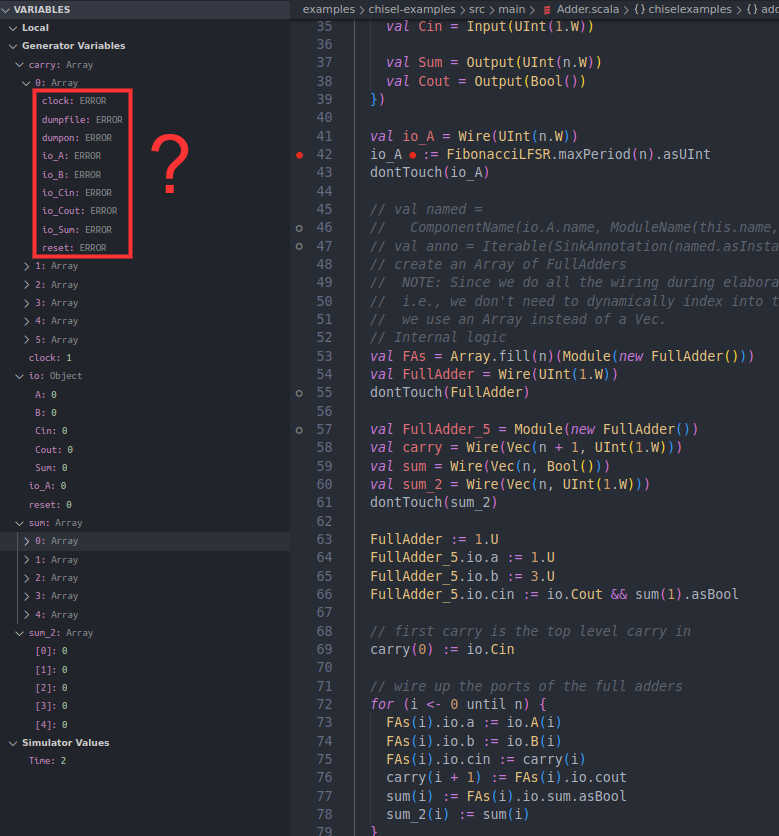    | 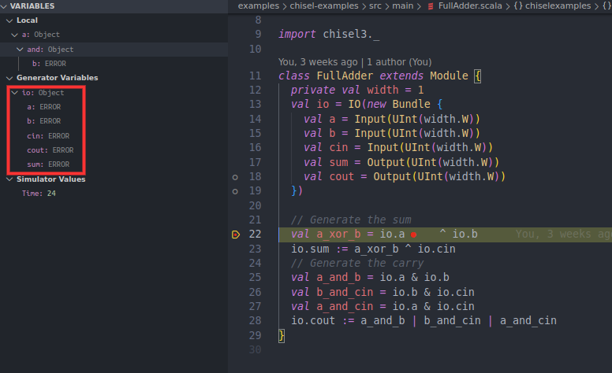 |
| --------------------------------------------------------- | -------------------------------------------------------------- |
| Fig. 6.1 - *Adder in HGDB using icarus backend simulator* | Fig. 6.2 - *FullAdder in HGDB using icarus backend simulator*  |

In `Adder` simulated by Verilator (fig. 7.1 and 7.2), some differences from Icarus:
- Vec elements as `carry` and `sum` are properly represented without any additional (non existing) sub-information.
- However, `Error` is displayed for those signals.

| 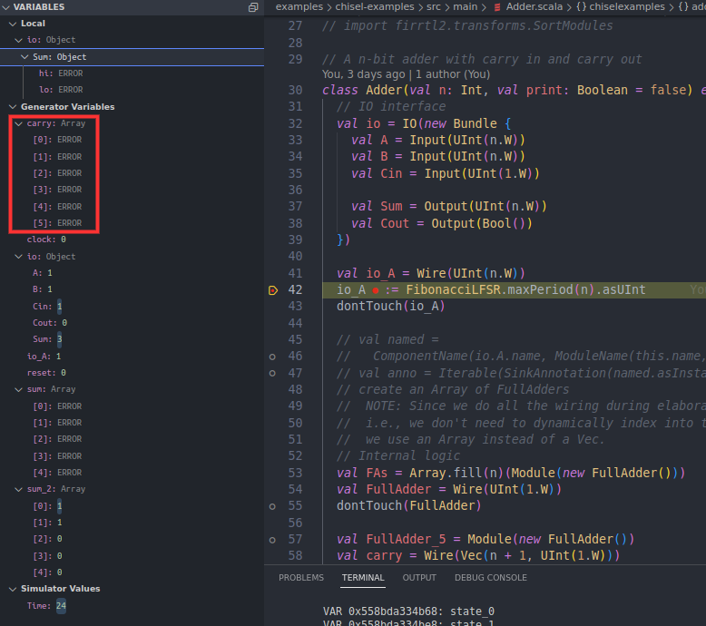    | 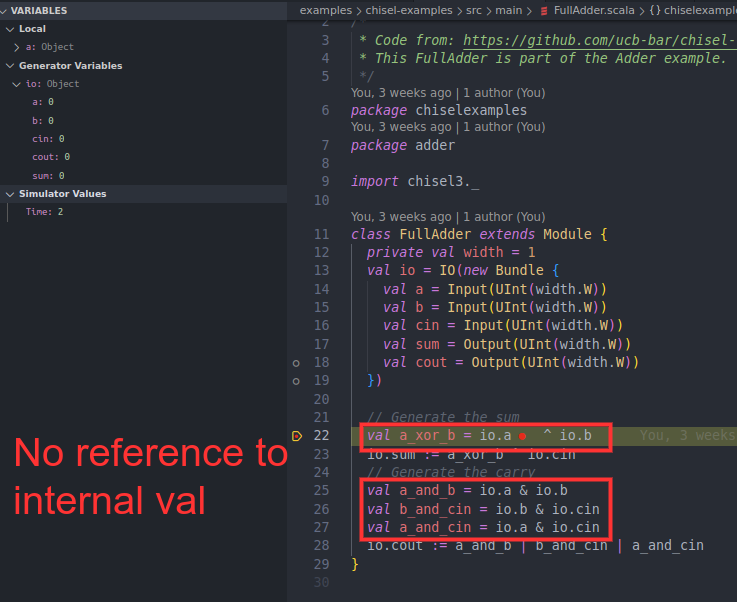 |
| ------------------------------------------------------------ | ----------------------------------------------------------------- |
| Fig. 7.1 - *Adder in HGDB using verilator backend simulator* | Fig. 7.2 - *FullAdder in HGDB using verilator backend simulator*  |

Finally, the icarus crashes after the second step of simulation is performed, while verilator does not even though it deadlocks if step into is used.

## 2. DetectTwoOnes: a simple finite state machine that uses `ChiselEnum` to represent the states
`DetectTwoOnes` is an example FSM that uses enumerations to encode its state. 
Chisel provides two ways to represent enumerations: `ChiselEnum` and `Enum`.
The first is used in this circuit while the second is used in the next example.

The ChiselEnum[^2] type is a chisel construct that helps limit errors when encoding numeric values into names (e.g. opcodes, mux selector, states etc...).
As shown in the code, the enum hide the actual numeric value of its variants, arising the abstraction level and improving safety.
Two different ChiselEnum objects represent two different types.

```scala
  object State extends ChiselEnum {
    val sNone, sOne1, sTwo1s = Value
  }

  val state = RegInit(State.sNone)
```

Thus, Chisel hides the knowledge of the actual numeric value of the state.

### 2.1. DetectTwoOnes in waveforms

Fig. 8 and 9 raises two issues in the waveform representation of a state register encoded with a `ChiselEnum`: 
1. No information about the state names (i.e. `sNone`) is available. 
  Designers must manually map the number dispayed to the actual state name by looking at the order of the states in the `ChiselEnum` declaration. 
  Although it does not seem a problem with few enum variants, this mapping may not be trivial for large enumerations.
2. Besides that, traces from some backends (i.e. Treadle and Verilator) classify registers as `wire`s instead of `reg`, such as the state val in the example.
  In fig. 8 the state val is describred as a wire, while in fig. 9 it is described as a register.
  This unexpected result raises additional discrepancy between the chisel code and its representation in waveforms.   
3. Finally, fig. 9 introduces another difference related to the used backend. 
  A new wire, absent in the code, is instead displayed (`_GEN_2`).
  This is generated in the verilog file used by Verilator and Icarus to support the state assignment.
  Conversely, this information is not available to the user and it may mislead them.
 
| 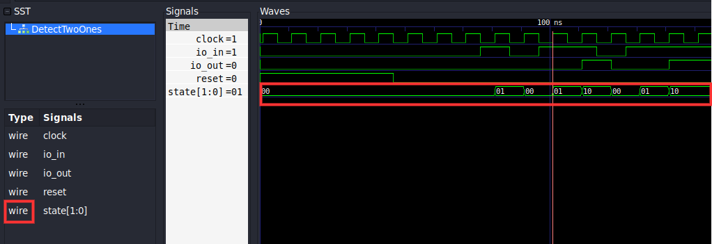                                            |
| --------------------------------------------------------------------------------------- |
| Fig. 8 - *A `ChiselEnum` is represented by only its numbered value in waveform viewers* |

| 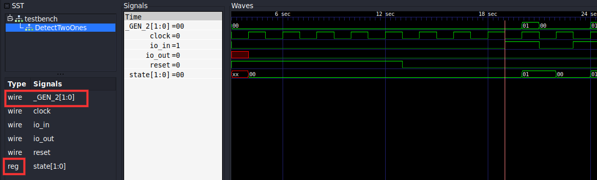 |
| ----------------------------------------------------------------------------------- |
| Fig. 9 - *A non-declared signal appears when the Icarus Verilog is executed*        |

### 2.2. DetectTwoOnes in HGDB

Fig. 10 shows a snapshot of the FSM internal signals from the HGDB debugger.
- Yet, no information about the state names. Only raw values. Also it is not possible what are the possible values of the states.
- No signal width information.
- Also here not possible to distinguish if a signal is a register or a wire from the left panel. This is although possible from the code. Since the user has a view of both code and debugger, it is not a big issue as in the waveforms.
- Here, I had a new problem while trying to simulate this example through HGDB. The FIRRTL representation, generated through `ChiselStage`[^6], contains some temp nodes (_T) that are propagated in the toml file used to generate the symbol table. This will raise errors like `Unable to validate breakpoint expression: !reset && !io_in && _T_5 && !_T_2`. To fix this I had to replace those strings with "1" in the toml file.

| 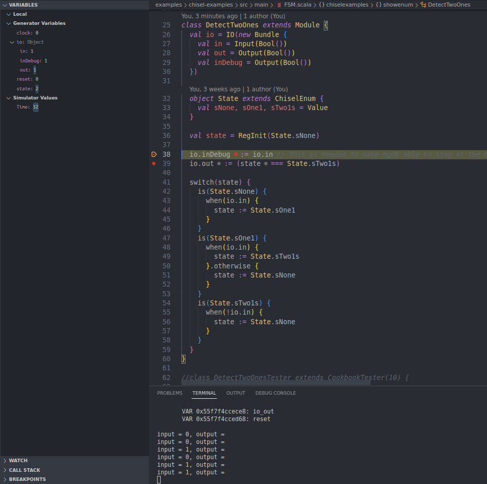                    |
| -------------------------------------------------------------- |
| Fig. 10 - *FSM in HGDB using the verilator backend simulation* |

## Parity: using `Enum` instead of `ChiselEnum`
Similarly to the previous example, `Parity` uses an enumeration to encode its state through the `Enum` type instead of `ChiselEnum`.

Analogously to `ChiselEnum`, `Enum` hides the actual numeric value of its variants.
However, a look to its documentation[^3] reveals that `Enum` directly implements a ist of unique `UInt` constants.
Consequently, the waveform viewers and hgdb print out numeric values without any reference to the enumeration variant name.

## Functionality: assign values to wires through different methods
The `Functionality` example shows how different methods to assign values to wires affect the waveform representation.

In particular, the example includes the following types of assignment:

- Use a boolean expression
  ```scala
  io.z_boolean := (io.x & io.y) | (~io.x & io.y)
  ```
- Using a function
  ```scala
  def clb(a: UInt, b: UInt, c: UInt, d: UInt) = (a & b) | (~c & d)
  io.z_function := clb(io.x, io.y, io.x, io.y)
  ```
- Using a `val`
  ```scala
  val clb_val = (io.x & io.y) | (~io.x & io.y)
  io.z_val := clb_val
  ```
- Using an `object`
  ```scala
  object CLB {
    def apply(a: UInt, b: UInt, c: UInt, d: UInt) = (a & b) | (~c & d)
  }
  io.z_object := CLB(io.x, io.y, io.x, io.y)
  ```
- Using a `class`
  ```scala
  class CLBClass {
    def apply(a: UInt, b: UInt, c: UInt, d: UInt) = (a & b) | (~c & d)
  }
  val clb_class = new CLBClass
  io.z_class := clb_class(io.x, io.y, io.x, io.y)
  ```

Fig. 8 illustrates the waveforms from a testbench of the Functionality module.
They shows that there is no difference between the 5 type assignments.
This is expected since the actual ports are of a `UInt` type, that is the only information passed to the backend.
Nonetheless, while dealing with chisel code, it would be useful to have a recall of what is the driving logic of a signal.
Although it might not be the most important features, this would allow to immediately insight the logic behind a signal.
Indeed, this is something available in code debuggers, such as hgdb[^4].

| 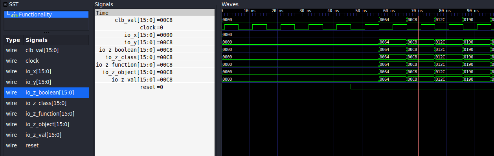 |
| -------------------------------------------------------------------------- |
| Fig. 8 - *Waveforms of the `Functionality` module*                         |

## Memory: a simple memory module that wraps the `Mem` chisel module
Chisel provides several constructs to represent memories[^5].
The `Mem` module implements a random-access memory that with asynchronous read and synchronous write ports. 
The `Memory` example serves to illustrate the `Mem` module representation in the testing tools.

Fig. 9.1 and 9.2 report frames of the waveforms from the same testbench of such a module, retrieved from vcd files dumped by treadle and verilator respectively. 
It is immediate to see that the treadle backend does not dump the whole memory content in a VCD, but only the read and write ports (called here `pipeline_data_0`).
Thus, it is not possible to inspect the memory content at any time step, but only when a read or write operation is performed and completed successfully.
By contrast, verilator provides a better representation of the content of the same memory block, although, memory arrays are not grouped together by default as visible in fig. 9.2. 
Thus, large memories may be difficult to inspect in waveforms due to representation which is not as concise as it could be.

| 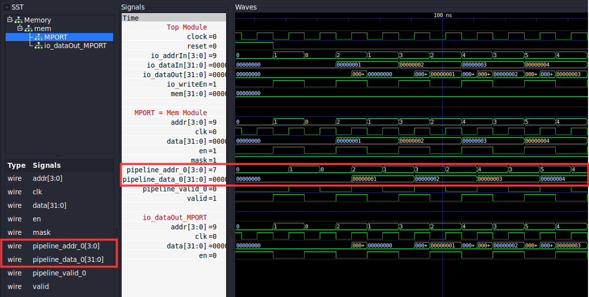           | 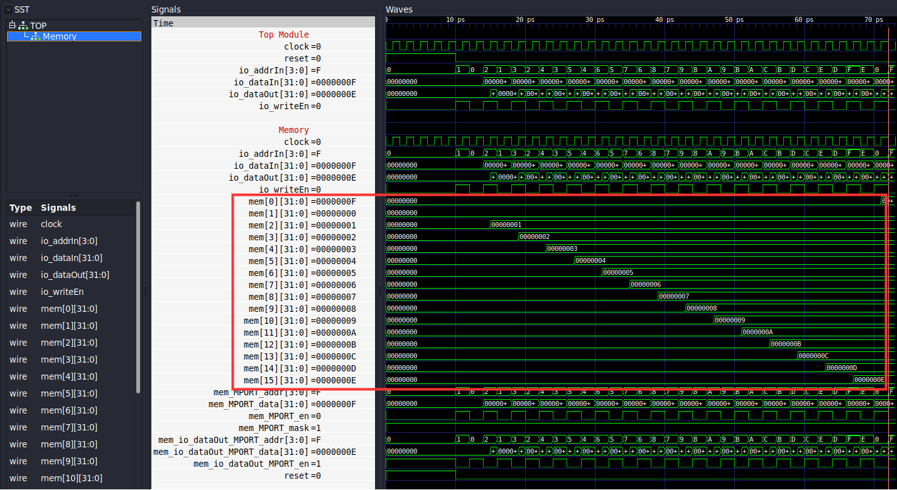           |
| ----------------------------------------------------------------------- | ------------------------------------------------------------------------- |
| Fig. 9.1 - *Waveforms of the `Memory` module using the treadle backend* | Fig. 9.2 - *Waveforms of the `Memory` module using the verilator backend* |

In order to understand why the two backends produce different results, I inspected the RTL codes used by each backend.
Treadle simulates a FIRRTL code while Verilator uses a Verilog representation.
The Verilog code contains a memory declaration (like `reg [3:0] table_ [0:15]`), while the emitted FIRRTL code only declares the pipeline ports signals.

> **Note:** The memory example will be extended in order to include all memories presented in the chisel explanation page[^5].

## Router: using chisel "typed" abstraction to represent circtuit components and characteristics
The `Router` is the most complex among the selected examples.
It uses classes and objects to represent and implement its components and characteristics.
For example, an `object` at the top of the file is used to group the main characteristics of the router, providing a parametrized implementation. This can be viewed similar to parameters in Verilog modules.
Moreover, Chisel allows to raise even more the abstraction level of a circuit: in this specific example, classes to describe read/write commands and packets are used, this means that the router is not composed by bare wires and registers, but chisel offers a virtual view of the circuit components.

The following code snippet contains the class used for the IO interface and shows this abstraction level. As it can be seen, from the code perspective, the `in` and `outs` port are of `Packet` type. Similarly, the `read_routing_table_request` and `load_routing_table_request` are of `ReadCmd` and `WriteCmd` type respectively. This means that the router is not composed by bare wires and registers, but chisel offers a virtual view of such "types".
```scala
class RouterIO(val n: Int) extends Bundle {

  val read_routing_table_request: DecoupledIO[ReadCmd] = DeqIO(new ReadCmd())
  val read_routing_table_response: DecoupledIO[UInt] = EnqIO(UInt(Router.addressWidth.W))
  val load_routing_table_request: DecoupledIO[WriteCmd] = DeqIO(new WriteCmd())

  val in: DecoupledIO[Packet] = DeqIO(new Packet())
  val outs: Vec[DecoupledIO[Packet]] = Vec(n, EnqIO(new Packet()))
}
```

Fig. 10 proves immediately that the abstraction level of the router is not reflected in the waveform representation.
First of all, there is no reference to the object `Router` in the waveforms, although it is declared in the code and it used to specify the router sizes.
When the designer writes their blocks, they just use the actual values through the defined parameters (i.e. `val read_routing_table_response: DecoupledIO[UInt] = EnqIO(UInt(Router.addressWidth.W))`)
Furthermore, there is no information related to what signals are related to a Packet, WriteCmd or ReadCmd. Every type declared as a class is decomposed in its fields and represented as separate signals.

Taking into account the `ReadCmd` and `WriteCmd` classes, it is trivial to understand why this is an issue.
```scala
class ReadCmd extends Bundle {
  val address = UInt(Router.addressWidth.W)
}
class WriteCmd extends ReadCmd {
  val data = UInt(Router.dataWidth.W)
}
```
Those classes have a common field `address`: looking at the figure, understanding whether `io_trad_routing_table_response` is a `ReadCmd` or not is far from trivial if only the waveforms (no comments, no code) are taken into account.


| 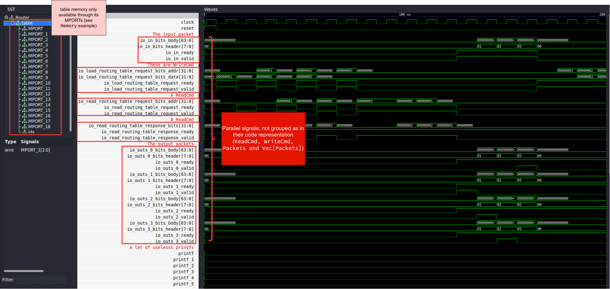 |
| -------------------------------------------------------------------------- |
| Fig. 10 - *Waveforms of the `Router` module using the treadle backend*     |


Fig. 11 shows how a slightly better representation of the router can be obtained by manually grouping signals per type. Nevertheless, this cannot be interpreted as a solution to the problem, since it is not given by default and it requires user knowledge and intervention any time something is changed in the code, leading to possible human mistakes. In addition, it does not solve the problem of the missing `Router` object and does not offer a typed representation.
| 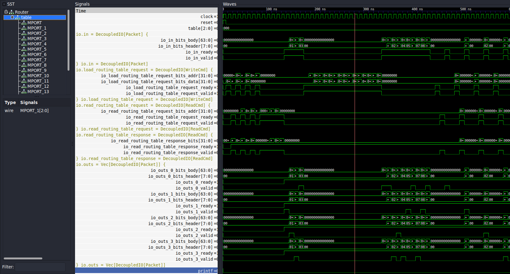                       |
| ----------------------------------------------------------------------------------------------------------------------------- |
| Fig. 11 - *A slightly better (manually created) waveform representation of the `Router` module with signals grouped per type* |

# References
[^1]: *Bundles and Vecs* | *Chisel*. en. [](https://www.chisel-lang.org/docs/explanations/bundles-and-vecs)

[^2]: *Enumerations* | *Chisel*. en. [](https://www.chisel-lang.org/docs/explanations/chisel-enum)

[^3]: *chisel3.util.Enum documentation* en. [](https://javadoc.io/static/edu.berkeley.cs/chisel3_2.12/3.3.0-RC1/chisel3/util/Enum.html)

[^4]: Keyi Zhang, Zain Asgar, and Mark Horowitz. **“Bringing source-level debugging frameworks to hard-ware generators”**. In: *Proceedings of the 59th ACM/IEEE Design Automation Conference*. DAC’22: 59th ACM/IEEE Design Automation Conference. San Francisco California: ACM, July 10, 2022, pp. 1171–1176. [](https://dl.acm.org/doi/10.1145/3489517.3530603)

[^5]: *Memories* | *Chisel*. en. [](https://www.chisel-lang.org/docs/explanations/memories)

[^6]: *circt.stage.ChiselStage* en. [](https://javadoc.io/doc/edu.berkeley.cs/chisel3_2.13/latest/index.html)