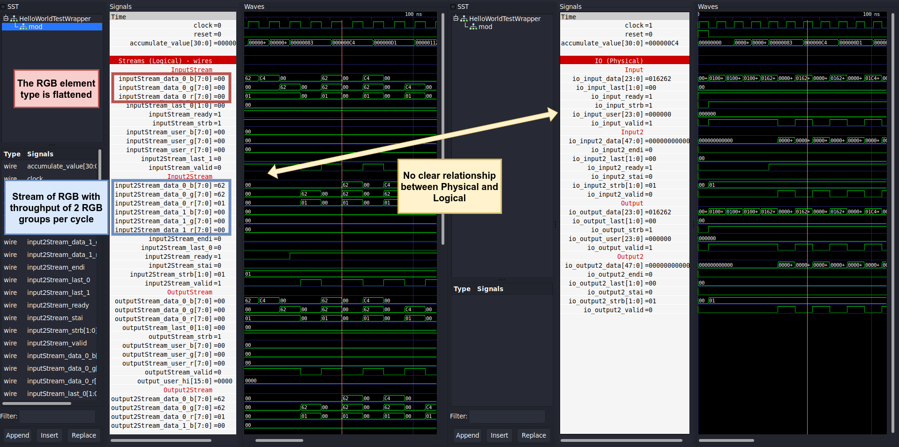
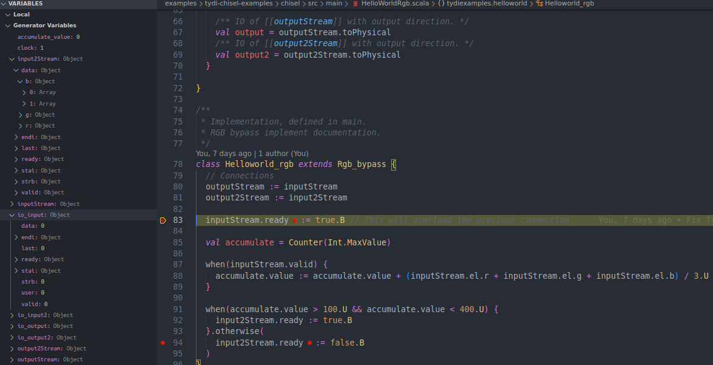

# A detailed analysis of Chisel and Tydi-Chisel representations in testing frameworks
This section proposes an analysis of how specific elements of Chisel and Tydi-Chisel are represented in different testing frameworks. 
This section aims to identify the weaknesses in the current representations with particular focus on the **gap** between the Chisel **source code** and the testing **framework representation**.
Namely, what the designer writes in Chisel and Tydi, and what they see in the testing framework.

> **Note:** A more general analysis about each testing frameworks is provided in each respective directory in [results](/results).

> **Note:** Source code of the examples is available in the [examples](../../examples/) directory.

- [A detailed analysis of Chisel and Tydi-Chisel representations in testing frameworks](#a-detailed-analysis-of-chisel-and-tydi-chisel-representations-in-testing-frameworks)
  - [1. Adder: a parametrized module that uses `Bundle`/`Vec` and `Array` to group signals and instantiate multiple modules](#1-adder-a-parametrized-module-that-uses-bundlevec-and-array-to-group-signals-and-instantiate-multiple-modules)
    - [1.1. Adder in waveforms](#11-adder-in-waveforms)
    - [1.2. Adder in HGDB](#12-adder-in-hgdb)
  - [2. DetectTwoOnes: a simple finite state machine that uses `ChiselEnum` to represent the states](#2-detecttwoones-a-simple-finite-state-machine-that-uses-chiselenum-to-represent-the-states)
    - [2.1. DetectTwoOnes in waveforms](#21-detecttwoones-in-waveforms)
    - [2.2. DetectTwoOnes in HGDB](#22-detecttwoones-in-hgdb)
  - [3. Parity: using `Enum` instead of `ChiselEnum`](#3-parity-using-enum-instead-of-chiselenum)
  - [4. Functionality: assign values to wires through different methods](#4-functionality-assign-values-to-wires-through-different-methods)
    - [4.1. Functionality in waveforms](#41-functionality-in-waveforms)
    - [4.2. Functionality in HGDB](#42-functionality-in-hgdb)
  - [5. Memory: a simple memory module that wraps the `Mem` chisel module](#5-memory-a-simple-memory-module-that-wraps-the-mem-chisel-module)
    - [5.1. Memory in waveforms](#51-memory-in-waveforms)
    - [5.2. Memory in HGDB](#52-memory-in-hgdb)
  - [6. Router: using chisel "typed" abstraction to represent circtuit components and characteristics](#6-router-using-chisel-typed-abstraction-to-represent-circtuit-components-and-characteristics)
    - [6.1. Router in waveforms](#61-router-in-waveforms)
    - [6.2. Router in HGDB](#62-router-in-hgdb)
  - [7. Tydi HelloWorldRgb: the simplest Tydi example](#7-tydi-helloworldrgb-the-simplest-tydi-example)
    - [7.1. Tydi HelloWorldRgb in waveforms](#71-tydi-helloworldrgb-in-waveforms)
    - [7.2. Tydi HelloWorldRgb in HGDB](#72-tydi-helloworldrgb-in-hgdb)
  - [8. Tydi PixelConverter: extending the HelloWorldRgb example](#8-tydi-pixelconverter-extending-the-helloworldrgb-example)
    - [8.1. Tydi PixelConverter in waveforms](#81-tydi-pixelconverter-in-waveforms)
    - [8.2. Tydi PixelConverter in HGDB](#82-tydi-pixelconverter-in-hgdb)
  - [9. Tydi PipelineSimple: filter and aggregate some values](#9-tydi-pipelinesimple-filter-and-aggregate-some-values)
    - [9.1. Tydi PipelineSimple in waveforms](#91-tydi-pipelinesimple-in-waveforms)
    - [9.2. Tydi PipelineSimple in HGDB](#92-tydi-pipelinesimple-in-hgdb)
  - [10. Tydi PipelineNestedGroup](#10-tydi-pipelinenestedgroup)
  - [11. Tydi PipelineNestedStream](#11-tydi-pipelinenestedstream)
    - [11.1. Tydi PipelineNestedStream in waveforms](#111-tydi-pipelinenestedstream-in-waveforms)
    - [11.2. Tydi PipelineNestedStream in HGDB](#112-tydi-pipelinenestedstream-in-hgdb)
- [Summary](#summary)
  - [Chisel elements](#chisel-elements)
  - [Tydi elements](#tydi-elements)
  - [Other findings](#other-findings)
- [References](#references)

## 1. Adder: a parametrized module that uses `Bundle`/`Vec` and `Array` to group signals and instantiate multiple modules
Chisel provides the `Bundle` and `Vec`[^1] classes to group signals together of different and same type respectively. 
Their elements can be accessed as named fields for `Bundle` and as indexed elements for `Vec`, similar to software `struct`/`class` and `array`.

In the chosen example, the `Adder` module uses such classes to group together the signals needed for the internal `carry`, `sum` and `IO` interface.

```scala
// IO interface
val io = IO(new Bundle {
    val A = Input(UInt(n.W))
    val B = Input(UInt(n.W))
    val Cin = Input(UInt(1.W))
    
    val Sum = Output(UInt(n.W))
    val Cout = Output(UInt(1.W))
})
// ...
// Internal carry and sum signals
val carry = Wire(Vec(n + 1, UInt(1.W)))
val sum = Wire(Vec(n, Bool()))
// ... 
```

A simpler carry propagate `Adder` consists of a concatenation of an `Array` of `FullAdder` modules, similarly to `generate` in verilog.
This allows to write a single line of code to instantiate n full adders.

```scala
// ...
// Carry propagate adder
val FAs = Array.fill(n)(Module(new FullAdder()))
// ...
```
Since Chisel is built on top of the scala language, its constructs can be used to manipulate the Chisel elements.
Bundle, Vec and Array can be simply accessed in the code as named fields and indexed elements. 
Moreover, for loops and integer variables can be used to iterate over arrays and vectors.
This is shown in the following code snippet. 

```scala
  // ...
  carry(0) := io.Cin          // accessing and assigning a vector element through indexing
  // ...
  for (i <- 0 until n) {      // use for loop to iterate over arrays
    // ...
    FAs(i).io.cin := carry(i) // indexing an array of modules and accessing its named fields
    carry(i + 1) := FAs(i).io.cout
    sum(i) := FAs(i).io.sum.asBool
  }
  // ...
  io.Sum := sum.asUInt
  io.Cout := carry(n)         // use parametrized integer variable to access vector element
```

The previous code snippets illustrate how a developer can declare, access, and manipulate `Bundle`, `Vec`, and `Array`. 
These basic constructs arise the abstraction level when compared to low-level HDLs and allow to orgnaize the code in a more structured and concise format.
In languages like Verilog, concepts similar to `Bundle` do not exist, despite the presence of bit vectors and arrays of bits (`Vec`).

### 1.1. Adder in waveforms

Fig. 1 shows a bundle representation in waveforms.
In contrast to its chisel "view", its elements are not grouped by default under an `io` group and they are not displayed as named fields. 
Yet, they are drawn as separate parallel signals and the parent bundle name can be retrieved from the signal name convention (`bundleName_signalName`). 

|                   |
| -------------------------------------------------------------------- |
| Fig. 1 - *A Chisel `Bundle` to group IO signals in waveform viewers* |

Similarly to bundles, also the waveform representation of vec does not match the code structure as it can be inspected in fig. 2. 
Indeed, vector elements are not grouped and displayed as indexed arrays, but they are represented as separate parallel signals.
Similarly to bundle the actual chisel `val`, associated to a vec, can be retrived from the signal name followed by an underscore and index (`name_i`).
Using `UInt(n.W)` instead of `Vec(n, UInt(1.W))` produces a different waveform representation more similar to a vector (see io_A in fig. 3).
However, `UInt` cannot be indexed in chisel.
Hence, it is not possible to access individual bits of a `val carry = Wire(UInt((n+1).W))` in the same way as `val carry = Wire(Vec(n + 1, UInt(1.W))))`.

|                       |
| ----------------------------------------------------------------------- |
| Fig. 2 - *A Chisel `Vec` to represent a bit vector in waveform viewers* |

Finally, the waveform representation of an array of modules is shown in fig. 3.
Comparatively to the previous cases, an array of modules kinda maintains the structure of the chisel code, since a sub-module is instantiated for each element (`FullAdder_i` in the example).
At the same time, they do not reflect that those FullAdders are grouped together in an array.

|      |
| ------------------------------------------------------------------------ |
| Fig. 3 - *A scala `Array` to instantiate multiple sub-modules in chisel* |

To test the robustness of this representation with this naming convention, I updated the code above by adding new `val` signals with the names that `io.A` and `sum(2)` have in fig. 1 and 2, namely `io_A` and `sum_2`.
This change does not affect behaviour of the previous logic. 
It does not raise issues while accessing the old signals since in Chisel:
```scala
  // These val are different: io.A is not io_A
  val io = IO(new Bundle {
    val A = Input(UInt(n.W))
  })
  val io_A = Wire(UInt(n.W))
  
  // Same for sum: sum(2) is not sum_2
  val sum = Wire(Vec(n, Bool()))
  val sum_2 = Wire(Vec(n, UInt(1.W)))
```
However, this update raises issues while inspecting signal names from waveform viewers due to the naming convention used for the translation to FIRRTL.
After I run the simulation with this new signals, such a simple addition to the code surprisingly affected the waveform signal names, despite the fact that the rest of chisel code remained untouched.
The signal (`val sum`) changed name in the viewer as shown in fig. 4. 
Since its original name is now not present anymore, the signal disappeared from the waveform viewer. 
Specifically, the old `sum_i` (`sum(i)` in chisel) is renamed to `sum__i`, it conflicted with the `val sum_2` in the FIRRTL representation.
This affected `io_A` in a similar manner.
As a consequence, FIRRTL naming convention makes more difficult to understand which names indicate which `val` in chisel code, leading to a naming "overlap" which is not present in the chisel code.

|                                                 |
| ---------------------------------------------------------------------------------------------------------------------------------- |
| Fig. 4 - *Some signal names in chisel causes name conflicts in the FIRRTL representation which may lead to confusion in waveforms* |

The code snippet below and fig. 5 provide another example of naming issues.
Here, a new wire named `FullAdder` and a module `FullAdder_5` are declared.
From fig. 5 it is counterintuitive to understand wether the `FullAdder` is used for the module `FAs(0)` or for the wire `FullAdder`. Similarly, it is impossible to establish if `FullAdder_5` is whether the 5th element of the array `FAs` or just a separate module `FullAdder_5`.

Going more in depth, this example shows additional problems:
- the name `FullAdder_5` in waveforms corresponds (incorrectly) to `FullAdder` in chisel
- `FullAdder_5_1` is related to the `FullAdder_5` module

<!-- This method that maps sub-elements of `Bundle`, `Vec` and `Array` to names followed by underscore and index/field name is  -->

```scala
// ...
// Carry propagate adder
val FAs = Array.fill(n)(Module(new FullAdder()))
val FullAdder = Wire(UInt(2.W))
val FullAdder_5 = Module(new FullAdder())
// ...
```

|            |
| --------------------------------------------------------------------------------------------- |
| Fig. 5 - *Another example in which some signal names in chisel causes confusion in waveforms* |

### 1.2. Adder in HGDB
Fig. 6.1 and 6.2 shows the HGDB-debugger snapshot for the `Adder` and `FullAdder` modules respectively.
Signals inside a bundle are grouped together under the bundle name and shown as named fields (i.e. `io`).
Similarly, elements of a vec are grouped as an array, preserving a structured representation.
However, in both cases bundle and vec are not shown with their real chisel type (`Bundle` and `Vec`) but instead they are associated to `Object` and `Array` respectively.
Some vec signals, such as carry, have an overcomplex structure.
Although a carry is simply a vec of `UInt`, the debugger shows other values such as clock, dumpfile etc.
At the same time, other vec signals (`sum_2`) are displayed correctly.

In contrast to waveforms, hgdb does not raise any issue related to the naming convention used.
The conflict, between `io_A` and `io.A`, is solved now.

Only the hierarchy of bundles and vec can be inspected at a given time.
There is no access nor reference to child modules.
In order to inspect sub signals, someone needs to place a breakpoint in one of the submodule lines as I did in fig. 6.2 for FullAdder.

|     |  |
| --------------------------------------------------------- | -------------------------------------------------------------- |
| Fig. 6.1 - *Adder in HGDB using icarus backend simulator* | Fig. 6.2 - *FullAdder in HGDB using icarus backend simulator*  |

Fig. 7.1 and 7.2 show how vec elements (i.e. carry and sum) are properly represented without any additional (non existing) sub-information.
Fig. 7.2 highlights a new issue: an internal `val` of a module is not accessed.
There are only references to chisel hardware types (`IO`, `Wire`, `Reg`). 

Both backends do not seem to provide proper values associated to signals, an ERROR is displayed multiple times.
In addition to that, they do not display information about the width of the signals and hardware type (i.e. `Wire(UInt(8.W))`).

|     |  |
| ------------------------------------------------------------ | ----------------------------------------------------------------- |
| Fig. 7.1 - *Adder in HGDB using verilator backend simulator* | Fig. 7.2 - *FullAdder in HGDB using verilator backend simulator*  |

Finally, the icarus crashes after the second step of simulation is performed, while verilator does not even though it deadlocks if step into is used.

## 2. DetectTwoOnes: a simple finite state machine that uses `ChiselEnum` to represent the states
`DetectTwoOnes` is an example FSM that uses enumerations to encode its state. 
Chisel provides two ways to represent enumerations: `ChiselEnum` and `Enum`.
The first is used in this circuit while the second is used in the next example (section [3](#3-parity-using-enum-instead-of-chiselenum)).

The ChiselEnum[^2] type is a chisel construct that helps to limit errors while encoding numeric values into names (e.g. opcodes, mux selector, states etc...).
As shown in the code, the enum hides the actual numeric value of its variants, arising the abstraction level and improving safety.
Two different ChiselEnum objects represent two different types.

```scala
  object State extends ChiselEnum {
    val sNone, sOne1, sTwo1s = Value
  }

  val state = RegInit(State.sNone)
```

Thus, Chisel hides the knowledge of the actual numeric value of the state.

### 2.1. DetectTwoOnes in waveforms

Fig. 8 and 9 raises two issues in the waveform representation of a state register encoded with a `ChiselEnum`: 
1. No information about the state names (i.e. `sNone`) is available. 
  Designers must manually map the number dispayed to the actual state name by looking at the order of the states in the `ChiselEnum` declaration. 
  Although it does not seem a problem with few enum variants, this association may not be trivial for large enumerations.
2. Besides that, traces from some backends (i.e. Treadle and Verilator) classify registers as `wire`s instead of `reg`, such as the state val in the example.
  In fig. 8 the state val is describred as a wire, while in fig. 9 it is described as a register.
  This unexpected result raises additional discrepancy between the chisel code and its representation in waveforms.   
3. Finally, fig. 9 introduces another difference related to the backend used. 
  A new wire, absent in the code, is instead displayed (`_GEN_2`).
  This is generated in the verilog file used by Verilator and Icarus to support the state assignment.
  Conversely, this information is not available to the user and it may mislead them.
 
|                                             |
| --------------------------------------------------------------------------------------- |
| Fig. 8 - *A `ChiselEnum` is represented by only its numbered value in waveform viewers* |

|  |
| ----------------------------------------------------------------------------------- |
| Fig. 9 - *A non-declared signal appears when the Icarus Verilog is executed*        |

### 2.2. DetectTwoOnes in HGDB

Fig. 10 shows a snapshot of the FSM internal signals from the HGDB debugger.
1. Yet, no information about the state names, but only raw values without any information about their association to the variant names.
2. Also here, it is not possible to distinguish if a signal is a register or a wire from the left panel.
   This is although possible from the code.
   Since the user has a view of both code and debugger, it may not be considere as the same issue as in the waveforms.
3. Here, I met a new issue while trying to simulate this example through HGDB. 
   The FIRRTL representation, generated through `ChiselStage`[^6], contains some temp nodes (_T) that are propagated in the toml file used to generate the symbol table.
   This will raise errors like `Unable to validate breakpoint expression: !reset && !io_in && _T_5 && !_T_2`.
   To fix this I had to replace those strings with "1" in the toml file.

|                     |
| -------------------------------------------------------------- |
| Fig. 10 - *FSM in HGDB using the verilator backend simulation* |

## 3. Parity: using `Enum` instead of `ChiselEnum`
Similarly to the previous example, `Parity` uses an enumeration to encode its state through the `Enum` type instead of `ChiselEnum`.

Analogously to `ChiselEnum`, `Enum` hides the actual numeric value of its variants.
However, a look to its documentation[^3] reveals that `Enum` directly implements a ist of unique `UInt` constants.
Consequently, the waveform viewers and hgdb print out numeric values without any reference to the enumeration variant name.

## 4. Functionality: assign values to wires through different methods
The `Functionality` example shows how different methods to assign values to wires affect the waveform representation.

In particular, the example includes the following types of assignment:

- Use a boolean expression
  ```scala
  io.z_boolean := (io.x & io.y) | (~io.x & io.y)
  ```
- Using a function
  ```scala
  def clb(a: UInt, b: UInt, c: UInt, d: UInt) = (a & b) | (~c & d)
  io.z_function := clb(io.x, io.y, io.x, io.y)
  ```
- Using a `val`
  ```scala
  val clb_val = (io.x & io.y) | (~io.x & io.y)
  io.z_val := clb_val
  ```
- Using an `object`
  ```scala
  object CLB {
    def apply(a: UInt, b: UInt, c: UInt, d: UInt) = (a & b) | (~c & d)
  }
  io.z_object := CLB(io.x, io.y, io.x, io.y)
  ```
- Using a `class`
  ```scala
  class CLBClass {
    def apply(a: UInt, b: UInt, c: UInt, d: UInt) = (a & b) | (~c & d)
  }
  val clb_class = new CLBClass
  io.z_class := clb_class(io.x, io.y, io.x, io.y)
  ```

### 4.1. Functionality in waveforms

Fig. 11 illustrates the waveforms from a testbench of the Functionality module.
It shows that there is no difference between the 5 type assignments.
This is expected though, since the actual ports are of a `UInt` type, that is the only information passed to the backend.

Nonetheless, while dealing with chisel code, it would be useful to have a recall to what is the driving logic of the selected signal.
Although it might not be the most important feature, this would allow to immediately insight the logic behind a value.

|  |
| -------------------------------------------------------------------------- |
| Fig. 11 - *Waveforms of the `Functionality` module*                        |

### 4.2. Functionality in HGDB

Similarly to the waveforms, also here there is no difference between the 5 type assignments.

|   |
| ------------------------------------------------------------------------ |
| Fig. 12 - *Functionality in HGDB using the verilator backend simulation* |

## 5. Memory: a simple memory module that wraps the `Mem` chisel module
Chisel provides several constructs to represent memories as reported in the documentation page[^5].
The `Mem` module implements a random-access memory with asynchronous read and synchronous write ports. 
The `Memory` example serves to illustrate the `Mem` module representation in the testing tools.

### 5.1. Memory in waveforms
Fig. 13.1 and 13.2 report frames of the waveforms, from the same testbench of such a module, dumped by treadle and verilator respectively. 
It is immediate to see that the treadle backend does not dump a variable to represent the whole memory content in a VCD, but it only dumps reading and writing ports (called here `pipeline_data_0`).
Thus, it is not possible to inspect the memory content at any time step, but only one value at each clock step is visible (when a read or write operation is performed and completed successfully).
By contrast, verilator provides a better representation of the content of the same memory block, although, memory arrays are not grouped together by default as visible in fig. 9.2. 
Thus, large memories may be difficult to inspect in waveforms due to representation which is not as concise as it could be.

|             |             |
| ------------------------------------------------------------------------ | -------------------------------------------------------------------------- |
| Fig. 13.1 - *Waveforms of the `Memory` module using the treadle backend* | Fig. 13.2 - *Waveforms of the `Memory` module using the verilator backend* |

In order to understand why the two backends produce different results, I inspected the RTL codes used by each backend.
Treadle simulates a FIRRTL code while Verilator uses a Verilog representation.
The Verilog code contains a memory declaration (like `reg [3:0] table_ [0:15]`), while the emitted FIRRTL code only declares the pipeline ports signals.

*Update:* The `MemoryToVcd(specifier: String)` allows to dump whole memory content or specific subsections of that also from treadle.
However, it is not displayed with a good formatting.
Its visualization is similar to the one provided in fig. 13.2.

> **Note:** The memory example will be extended in the near future in order to include all memories presented in the chisel explanation page[^5].

### 5.2. Memory in HGDB
It is clear to see, from fig. 14, that also HGDB does not provide a good visualization of the memory content. Yet, only input/output ports can be inspected.

|                 |
| ----------------------------------------------------------------- |
| Fig. 14 - *Memory in HGDB using the verilator backend simulation* |

## 6. Router: using chisel "typed" abstraction to represent circtuit components and characteristics
The `Router` is the most complex example between the ones selected.
It uses classes and objects to represent and implement its components and characteristics.
For example, an `object` at the top of the file is used to group the main characteristics of the router, providing a parametrized implementation.
This can be seen as similar to parameters in Verilog modules.
Moreover, Chisel allows to raise even more the abstraction level of a circuit: in this specific example, classes to describe read/write commands and packets are used.
This means that the router is not composed by bare wires and registers, but chisel offers a virtual view of such "types".

The following code snippet contains the class used for the IO interface and shows this abstraction level.
As it can be seen, from the code perspective, the `in` and `outs` port are of `Packet` type. 
Similarly, the `read_routing_table_request` and `load_routing_table_request` are of `ReadCmd` and `WriteCmd` type respectively.

```scala
class RouterIO(val n: Int) extends Bundle {

  val read_routing_table_request: DecoupledIO[ReadCmd] = DeqIO(new ReadCmd())
  val read_routing_table_response: DecoupledIO[UInt] = EnqIO(UInt(Router.addressWidth.W))
  val load_routing_table_request: DecoupledIO[WriteCmd] = DeqIO(new WriteCmd())

  val in: DecoupledIO[Packet] = DeqIO(new Packet())
  val outs: Vec[DecoupledIO[Packet]] = Vec(n, EnqIO(new Packet()))
}
```

### 6.1. Router in waveforms

Fig. 15 proves immediately that the abstraction level of the router module is not reflected in the waveform representation.
First of all, there is no reference to the object `Router` in the waveforms, although it is declared in the code and it is used to specify the router sizes.
When the designer writes their blocks, they just use the actual values through the defined parameters (i.e. `val read_routing_table_response: DecoupledIO[UInt] = EnqIO(UInt(Router.addressWidth.W))`)
Furthermore, there is no information about what signals are related to a Packet, WriteCmd or ReadCmd.
Every type declared as a class is decomposed in its fields and represented as separate bit signals.
Namely, values associated to a `Packet` wire are not of `DecoupledIO[Packet]` type.

Taking into account the `ReadCmd` and `WriteCmd` classes, it is trivial to understand why this is an issue.
The two classes share the address field.
If the class type is dropped, it is really difficult to understand wether the address is associated to a `ReadCmd` or `WriteCmd`.
```scala
class ReadCmd extends Bundle {
  val address = UInt(Router.addressWidth.W)
}
class WriteCmd extends ReadCmd {
  val data = UInt(Router.dataWidth.W)
}
```
The figure proves that: understanding whether `io_trad_routing_table_response` is a `ReadCmd` or not is far from trivial if only the waveforms (no comments, no code) are taken into account.


|  |
| -------------------------------------------------------------------------- |
| Fig. 15 - *Waveforms of the `Router` module using the treadle backend*     |


Fig. 16 shows how a slightly better representation of the router can be obtained by manually grouping signals per type.
Nevertheless, this cannot be interpreted as a solution to the problem, since it is not given by default and it requires the user's knowledge and intervention any time something is changed in the code, leading to possible human mistakes.
In addition, it does not solve the problem of the missing `Router` object and does not offer a typed representation.

|                        |
| ----------------------------------------------------------------------------------------------------------------------------- |
| Fig. 16 - *A slightly better (manually created) waveform representation of the `Router` module with signals grouped per type* |

### 6.2. Router in HGDB
Also HGDB has no knowledge about the router characteristics declared in the `object Router` (i.e. `Router.addressWidth` and `Router.dataWidth`).

No information about `Packet`, `ReadCmd` and `WriteCmd` types is provided.
This can be only inspected by looking at the fields and at the code concurrently: for example `load_routing_table` appears as an object with fields `bits.addr`, `bits.data`, `ready` and `valid`.
Every type in chisel that contains nested fields is an `Object` in HGDB, otherwise it is a simple numeric type without any information if `UInt`, `Bool` or `SInt` and without any width associated.

|                 |
| ----------------------------------------------------------------- |
| Fig. 17 - *Router in HGDB using the verilator backend simulation* |

## 7. Tydi HelloWorldRgb: the simplest Tydi example

The `HelloWorldRgb` is the simplest Tydi example. 
It simply instantiates two streams of a group called `Rgb` and redirects the input streams to the output streams.

An `Rgb` group is defined, in tydi-lang[^7], as a collection of 3 `color_channel_type` signals (internally implemented as a `Bit` of `color_depth` bits).
As it can be seen from the following code snippet, tydi-lang allows to define Streams and connect them together in few lines of code, while hiding the complexity of the underlying implementation code (chisel) of the streams.
Once compiled to boilerplate code, the `Tydi-Chisel`[^8] [^9] library hides the complexity of the actual internal implementation providing logical wrappers (`PhysicalStreamDetailed`) that raises the level of abstraction.

```cpp
// Define an rgb
color_depth = 8;
color_channel_type = Bit(color_depth);
Group Rgb {
  r: color_channel_type;
  g: color_channel_type;
  b: color_channel_type;
}
// ...
stream_type = Stream(Rgb, u=Rgb, c=complexity_level, t=throughput, r=direction, x=keep, d=dimension);
stream2_type = Stream(Rgb, user_type=Null, complexity=1, throughput=2., direction="Reverse", keep=true, dimension=1);

// #RGB bypass streamlet documentation#
streamlet rgb_bypass {
  input: stream_type in;
  output: stream_type out;
  input2: stream2_type in;
  output2: stream2_type out;
}

// #RGB bypass implement documentation#
impl helloworld_rgb of rgb_bypass {
  // #Stream 1#
  self.input => self.output;
  // #Stream 2#
  self.input2 => self.output2;
}
```

Summarizing, the `HelloWorldRgb` example shows how tydi-lang can be used to declare composite data types and connection between streams, abstracting the actual implementation details and behaviour of the circuit.
From the tydi perspective the user is sending `Rgb` groups through two tydi streams.
The tydi-lang-2-transpiler[^10] generates chisel boilerplate code in which the user can specify the actual behaviour of core modules that are connected through tydi streams.
The actual implementation of tydi streams is hidden by the Tydi-Chisel library which implements the tydi specification and integrates utilities to use streams in chisel.
Next sections show how these streams and data groups are represented in waveform viewers and in the HGDB debugger.

### 7.1. Tydi HelloWorldRgb in waveforms

Fig. 18 shows the waveform representation of the `HelloWorldRgb` example.
The trace files have been generated using chiseltest, similarly to the previous examples.

There is no concept of the `Rgb` group type, the stream element is not represented by its logical type but rather it is decomposed in its "lowest level" fields (r, g and b) and reported as separate signals.
This suggests that more complex groups (i.e. nested groups section [8](#8-tydi-pixelconverter-extending-the-helloworldrgb-example) or other types) will be "flattened" in the same manner.
Accordingly to the examples in sections 1-6, signals of logical streams (internally implemented as bundles) are not grouped and no abstraction is provided.
Indeed, the actual detailed representation of streams is used in the waveforms.
Moreover, streams with throupughts higher than 1 may lead to an explosion of number of separate signals in the waveforms, making inspection even less organized.
With reference to the example, `stream2_type` as a throuput of 2 so the data bus is duplicated (2 groups of `Rgb` can be sent every clock cycle).
This internally leads to 2 bits of strobe and 6 parallel data buses without any grouping.
Finally, both logical and physical stream implementations (`PhysicalStreamDetailed` and `PhysicalStream`) are displayed in the waveforms. 
Unfortunately, no clear distinction between them is visible.

|                                           |
| ---------------------------------------------------------------------------------------------------------------------------- |
| Fig. 18 - *Tydi HelloWorldRgb module in waveforms. Left: logical streams. Right: physical IO ports for streams tydi streams* |

### 7.2. Tydi HelloWorldRgb in HGDB

The HGDB debugger still preserves the same issues addressed in the chisel examples.
Thus, every chisel module is considered a generic `Object`, no information about the actual type, direction and width of the signals is provided (i.e. UInt, Vec, Bundle, Wire, Input, Output, etc...).
However, the hierarchy of bundles and vecs can be still fully inspected.

Within the tydi context, none of the stream characteristics are available such as the throughput and complexity level of a tydi stream. 
As addressed in the waveform viewers, also here no distinction between logical and physical streams can be made since they are both of Object type.

|  |
| ----------------------------------------------------------------------------- |
| Fig. 19 - *Tydi HelloWorldRgb module in HGDB*                                 |

## 8. Tydi PixelConverter: extending the HelloWorldRgb example

The `PixelConverter` extends the `HelloWorldRgb` example by implementing more complex data structures that represent a pixel.
In particular, it implements a tydi `union` to define a color variant for a pixel and it makes use of templates to define its types.
It also uses nested groups to define the pixel type.

As it can be seen from the code snippet below, tydi-lang facilitates to declare complex types in a structured and concise format.
Tydi templates enhance the abstraction level, allowing to define a type once and use it in multiple places with different characteristics.
For example, the `Float` type can be used to define different custom floating point types with different mantissa and exponent sizes.

```cpp
// ....
Group Rgb<color_depth: int> {
  color_channel_t = Bit(color_depth);
  r: color_channel_t;
  g: color_channel_t;
  b: color_channel_t;
}

Union Color<color_depth: int> {
  rgb_t = Rgb<color_depth>;
  rgb: rgb_t;
  gray: rgb_t.color_channel_t; // it is only one channel
}

Group UInt<n: int> { value: Bit(n); }

Group Float<n_mantissa: int, n_exponent: int> {
  sign: Bit(1); // anonymous field, 0 is positive, 1 is negative
  mantissa: UInt<n_mantissa>;
  exponent: UInt<n_exponent>;
}

Group Pos { x: Float<23, 8>; y: Float<23, 8>; }

Group Pixel {
  pos: Pos;
  color: Color<color_depth>;
}
// ....
```

### 8.1. Tydi PixelConverter in waveforms

As expected from the previous examples, the nested groups that define a pixel are flattened, in waveform viewers, into their lowest level fields as shown in fig. 20.
This example also introduces the usage of unions which can define a variant type: in this example the color variant of a pixel, either grayscale or rgb.
It is difficult to understand what variant is currently selected by simply taking a look at the figure.
Instead, the user must manually understand the association between the tag field value and the union variants.
It is clear to see that this can not be a trivial task while dealing with large unions.

A better representation of unions and nested groups is therefore needed to improve readability.

|  |
| -------------------------------------------------------------------------------------------- |
| Fig. 20 - *Tydi PixelConverter module in waveforms*                                          |

### 8.2. Tydi PixelConverter in HGDB

Fig. 21 shows that also the hgdb debugger is not able to well represent the union variants.
This is however something expected since the tydi union is a logic type of the tydi specification and it does not have a direct translation to chisel.

|  |
| -------------------------------------------------------------------------------------- |
| Fig. 21 - *Tydi PixelConverter module in HGDB*                                         |

## 9. Tydi PipelineSimple: filter and aggregate some values

This example implements a two stages pipeline to filter and aggregate some input values.
It uses two modules to perform the stages and a top module that instantiates the stages and connects their streams.
This is also the first example that uses two different types of streams, the top has indeed a `NumberGroup` input stream and a `Stats` output stream.
Whereas all the previous examples used only streams of the same data type.

```cpp
// package pipelineSimple_types
NumberGroup_stream = Stream(NumberGroup, t=1.0, d=1, c=1);
Stats_stream = Stream(Stats, t=1.0, d=1, c=1);

// Tydi-lang code
// #Interface for the non negative filter: df.filter(col("value") >= 0)#
streamlet NonNegativeFilter_interface<in_t: type> {
    std_in : pipelineSimple_types.NumberGroup_stream in;
    std_out : pipelineSimple_types.NumberGroup_stream out;
}

// #Implementation of df.filter(col("value") >= 0)#
impl NonNegativeFilter of NonNegativeFilter_interface<pipelineSimple_types.NumberGroup_stream> {}

// #Interface for the agg function#
streamlet Reducer_interface {
    std_in : pipelineSimple_types.NumberGroup_stream in;
    std_out : pipelineSimple_types.Stats_stream out;
}

// #Implementation of the agg function#
impl Reducer of Reducer_interface {}

// #Top level interface#
streamlet PipelineSimple_interface {
    std_in : pipelineSimple_types.NumberGroup_stream in;
    std_out : pipelineSimple_types.Stats_stream out;
}
// #Top level implementation. It instantiates the subcomponents and connects them together#
impl PipelineSimple of PipelineSimple_interface {
    // Instantiate the subcomponents
    instance filter(NonNegativeFilter);
    instance reducer(Reducer);

    // Connect the subcomponents
    self.std_in => filter.std_in;
    filter.std_out => reducer.std_in;
    reducer.std_out => self.std_out;
}
```

### 9.1. Tydi PipelineSimple in waveforms

Fig. 22 includes the output waveforms of a PipelineSimple test bench and highlights the logical streams.
As depicted by the figure, there is no clear distinction between the two types of stream in the Reducer module.
Although the difference is clearly visible from the tydi-lang code, the designer can get it only from the signal names. 

|  |
| -------------------------------------------------------------------------------------------- |
| Fig. 22 - *Tydi PipelineSimple: Filter and Reducer (with 2 stream types) in waveforms.*      |

### 9.2. Tydi PipelineSimple in HGDB

Similarly to the waveforms and other signals according to the previous examples, also the HGDB debugger does not provide an intuitive representation of those streams.
Hence, it makes really difficult to understand what types streams have and what structures they exchange.

## 10. Tydi PipelineNestedGroup

This example extends the PipelineSimple module with a tydi nested group.

```cpp
// #A composite type (like a struct) that contains a value associated with a timestamp#
Group NumberGroup {
    value: SInt_64_t;
    time: UInt_64_t; 
}
// #A DateTimeGroup represents a specific date time#
Group DateTimeGroup {
    month: Month_t;
    day: Day_t;
    year: Year_t;
    utc: UTC_t;
}
// #A NestedNumberGroup represents a number group with a nested date time group#
Group NestedNumberGroup {
    value: SInt_64_t;
    time: UInt_64_t;
    
    numberGroup: NumberGroup; // nested group
    date: DateTimeGroup; // nested group
}
NestedNumberGroup_stream = Stream(NestedNumberGroup, t=1.0, d=1, c=1);
```
It does not introduce any significant issues that were not already addressed in the previous examples.

## 11. Tydi PipelineNestedStream

The most complex tydi example is the `PipelineNestedStream` that extends the `PipelineNestedGroup` example with nested streams.
Tydi logic groups can contain streams as fields, and therefore this allows to define nested streams that appear as simple named fields of the group at the logical level.

PipelineNestedStream implements one example usage of nested streams: some fields associated to string of unknown length (a stream of chars).
```cpp
// Define a char stream
Char_t = Bit(8); // UInt<8>
Char_stream = Stream(Char_t, t=3.0, d=1, c=1); // Stream of 3 chars per clock cycle

// #The Number Group from PipelineNestedGroup extended with a nested stream#
Group NumberGroupWithString {
    numberNested: pipelineNestedGroup_types.NumberGroup;
    date: pipelineNestedGroup_types.DateTimeGroup;
    my_custom_string: Char_stream;
}

// #The Stats from PipelineSimple extended with a nested stream#
Group StatsWithString {
    stats: pipelineSimple_types.Stats;
    my_custom_string: Char_stream;
}
NumberGroupWithString_stream = Stream(NumberGroupWithString, t=1.0, d=1, c=1);
Stats_stream = Stream(StatsWithString, t=1.0, d=1, c=1);
```

### 11.1. Tydi PipelineNestedStream in waveforms

Fig. 23 reports the waveforms for the aforementioned example.
The figure highlights the structure of the `NumberGroupWithString` streams.
In the waveform representation a nested (child) stream is shown as a separate stream, that is independent from the parent stream.
Despite nested streams are internally implemented as separate signals, due to the limitations of the low level HDLs, tydi-lang provides a logical hierarchical representation of parent and child streams.
Current trace files do not support this logic level representation, and the association is hidden in the signal names only, making it difficult to understand relationships between streams.
With more complex circuits this issue may become even more relevant.
A new, higher level representation may improve readability and reduce debugging effort.

|  |
| ---------------------------------------------------------------------------------------------------------------- |
| Fig. 23 - *Tydi PipelineNestedStream: NumberGroupWithString and StatsWithString in waveforms.*                   |

### 11.2. Tydi PipelineNestedStream in HGDB

On the contrary of the waveforms, the HGDB debugger is able to preserve the hierarchical structure of nested streams.
However, it still has the same issues already addressed in the previous examples.

|                                                                                                                                                      |
| -------------------------------------------------------------------------------------------------------------------------------------------------------------------------------------------------------------------------------------------------------------- |
| Fig. 24 - *Tydi PipelineNestedStream preserves the hierarchical structure of nested streams in HGDB. Nested NumberGroup (numberNested, blue) and nested Char_stream (my_custom_string, green) are childs "variables" of NumberGroupWithSting (inStream, red).* |


# Summary
## Chisel elements
- `Bundle`: group together several **named** fields of potentially different types into a coherent unit.
  - Waveforms:
    - Not grouped in the waveforms. Signals are shown separately and not as named field of the parent bundle.
    - Shown as `bundleName_signalName` (ideally, `signalName` should a child of `bundleName` but it is not the case in the waveforms).
    - No respective logic in verilog/vhdl.
  - HGDB:
    - The structure of the bundle (hierarchy and named fields) is preserved.
    - The type is associated to `Object` instead of `Bundle`.
    - No reference to basic types (UInt, SInt, Bool, etc...) as well as width, reg, wire, input, output.
- `Vec`: an indexable vector of elements.
  - Waveforms:
    - Not shown as indexed elements. Displayed as separate parallel signals.
    - Shown as `vecName_index`.
    - Similar to a bit vector but more powerful since it can also have different sizes than a bit
  - HGDB:
    - The structure of the vec is preserved. The hierarchy and indexed elements are shown.
    - The type is associated to `Array` instead of `Vec`.
    - Overcomplicated representation of the vec. 
- Scala array of modules: used to instantiate multiple modules of the same type.
  - Waveforms:
    - Instantiated as `moduleName_index`.
    - Modules are not grouped as part of an array
  - HGDB:
    - No access to signals of child modules from a breakpoint in a parent module. Only hierarchy of vec and bundle can be inspected.
- ChiselEnum or Enum: reduce the chance of error when encoding mux selectors, opcodes, and functional unit operations.
  - Waveforms:
    - No information about the enum variants (i.e. `sNone`).
    - Some backends generate additional wires (i.e. `_GEN_2`) that are used internally.
  - HGDB:
  - No information about the state names (i.e. `sNone`).
  - Some times some temp nodes in the symbol table cause crashes.
- Functionality: assign values to wires through functions, val, object and class.
  - No distinction between the 5 type assignments in bboth waveforms and HGDB.
- `Memories`:
  - Waveforms:
    - The whole memory content cannot be inspected if the Treadle backend is used. Treadle only dumps reading and writing ports in the VCD.
    - Verilator allows to inspect the whole content of a memory block, although, values are not grouped together by default.
    - *Update*: The `MemoryToVcd` annotation allows to print the whole memory content with treadle, like verilator. 
  - HGDB:
    - No information about the entire memory content.
    - Only input/output ports can be inspected.
- Router: using chisel "typed" abstraction to represent circtuit components and characteristics.
  - No information about the parameters used to define the router.
  - No information about class types (i.e. Packet, ReadCmd, WriteCmd) and basic types (i.e. UInt, SInt, Bool, etc...).

## Tydi elements
There is no information about tydi types and streams in both waveforms and HGDB.
Both basic (Null, Bits, Group, Union and Stream) and custom types (implementations of basic types) are not shown in the waveforms and in HGDB.
- `Bits`: a bit type with a specific width. 
  - Implemented inn Tydi-Chisel as an extention of basic types (UInt, SInt, Bool).
  - Same issues related to basic types in chisel.
- `Group`: a composite type (like a struct) that contains a set of fields of potentially different types.
  - Similar to chisel bundles.
  - No information about the fields of the group.
- `Union`: a variant type that can contain one of several different types.
  - Similar to a chisel bundle/enum with a tag associated to the selected variant.
  - No information about the union variants.
- `Stream`: a stream of elements of a specific type.
  - No information about the stream type and its characteristics.
- Tydi emplates:
  - No reference to templates.
- Nested groups and streams:
  - Hierarchy is not preserved in the waveforms. It is difficult to understand that a stream is nested in another stream.
  - HGDB preserves the hierarchy in both cases.

## Other findings
- Naming convention issue in waveforms:
  - some names (allowed in chisel) may cause overlaps in the waveforms
  - for example a bundle `X` with a field `A` and a signal named `X_A` would have the same name in waveforms but if instantiated in the same logic block, their names are not sure
  - this naming convention issue affects both "conflicting" signals, "conflicting" modules and "conflicting" modules with signals.
- No issue associated to the naming convention in HGDB.
- No distinction between registers and wires in some backends.
- No reference to intermediate internal `val` of a module in HGDB and often in waveforms.
- Icarus verilog test (generated using chiseltest) crashes after the 2nd simulation clock cycle.
- HGDB does not provide distinction between reg, wires, input, output, etc..., basic types (UInt, SInt, Bool, etc...) and signal width.

# References
[^1]: *Bundles and Vecs* | *Chisel*. en. [](https://www.chisel-lang.org/docs/explanations/bundles-and-vecs)

[^2]: *Enumerations* | *Chisel*. en. [](https://www.chisel-lang.org/docs/explanations/chisel-enum)

[^3]: *chisel3.util.Enum documentation* en. [](https://javadoc.io/static/edu.berkeley.cs/chisel3_2.12/3.3.0-RC1/chisel3/util/Enum.html)

[^4]: Keyi Zhang, Zain Asgar, and Mark Horowitz. **“Bringing source-level debugging frameworks to hardware generators”**. In: *Proceedings of the 59th ACM/IEEE Design Automation Conference*. DAC’22: 59th ACM/IEEE Design Automation Conference. San Francisco California: ACM, July 10, 2022, pp. 1171–1176. [](https://dl.acm.org/doi/10.1145/3489517.3530603)

[^5]: *Memories* | *Chisel*. en. [](https://www.chisel-lang.org/docs/explanations/memories)

[^6]: *circt.stage.ChiselStage* en. [](https://javadoc.io/doc/edu.berkeley.cs/chisel3_2.13/latest/index.html)

[^7]: Yongding Tian et al. **“Tydi-lang: A Language for Typed Streaming Hardware”**. In: *Proceedings of the SC ’23 Workshops of The International Conference on High Performance Computing, Network, Storage, and Analysis*. Denver CO USA: ACM, Nov. 12, 2023, pp. 521–529. ISBN: 9798400707858. [](https://doi.org/10.1145/3624062.3624539)

[^8]: Casper Cromjongh et al. **“Tydi-Chisel: Collaborative and Interface-Driven Data-Streaming Accelerators”**. In: *2023 IEEE Nordic Circuits and Systems Conference (NorCAS*). Aalborg, Denmark: IEEE, Oct. 31, 2023, pp. 1–7. ISBN: 9798350337570. [](https://doi.org/10.1109/NorCAS58970.2023.10305451)

[^9]: A implementation of Tydi interfaces and concepts in Chisel. [](https://github.com/ccromjongh/Tydi-Chisel)

[^10]: The Tydi-lang-2-Chisel transpiler. [](https://github.com/ccromjongh/tydi-lang-2-chisel)
