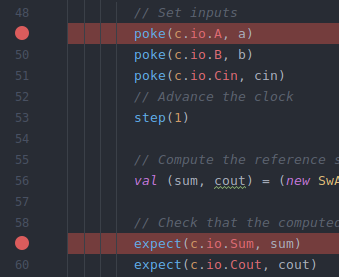
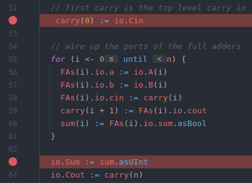
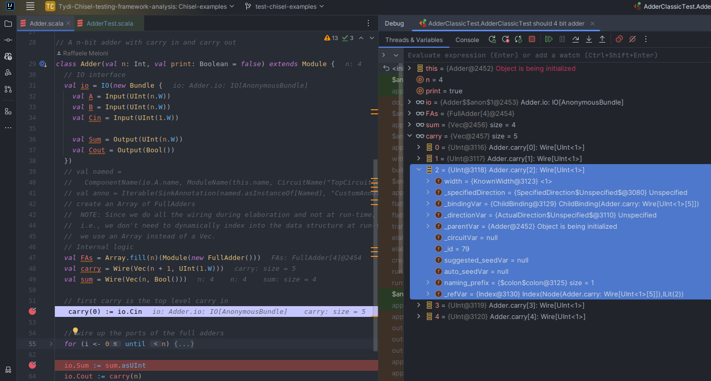
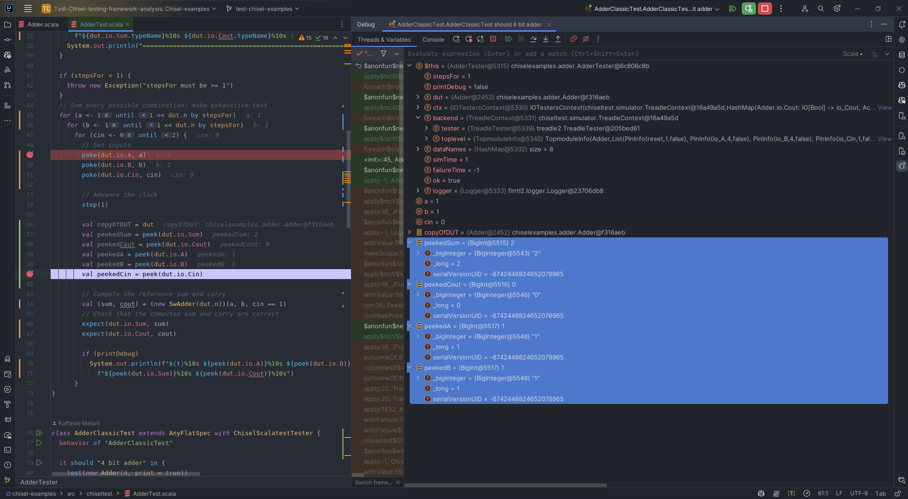
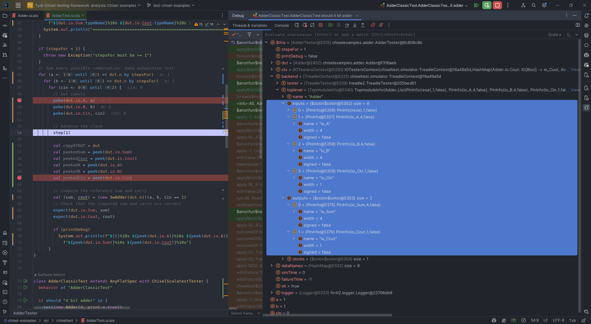

# Chiseltest: how `Chisel` and `Tydi-Chisel` code features are represented in `chiseltest`
The [summary](../README.md#chiseltest) about chiseltest provided general considerations about the framework and its features.

Here, a more detailed analysis of how `Chisel` and `Tydi-Chisel` code features are represented in `chiseltest` is provided.
The document is divided per example where each example tries to address a specific feature provided by `Chisel` and `Tydi-Chisel`.

Most of the times, designers need to visually inspect signal values during simulation to understand the current behavior of the design under test. Hence, this analysis focuses on the representation of elements in testing frameworks w.r.t. their representation in source code.`printf`s, `treadle2.VerboseAnnotation` and `IntelliJ` IDEA breakpoint debugging can be used together with chiseltest for this purpose.

## Adder: using `Bundle`/`Vec` and `Array` to group signals and instantiate multiple modules
Chisel provides the `Bundle` and `Vec` classes to group signals together of different and same type respectively. Their elements can be accessed as named fields for `Bundle` and as indexed elements for `Vec`, similar to software `struct`/`classes` and `array` respectively.

In the chosen example, the `Adder` module uses such classes to group together the signals needed for the internal `carry`, `sum` and `IO` interface.

```scala
// IO interface
val io = IO(new Bundle {
    val A = Input(UInt(n.W))
    val B = Input(UInt(n.W))
    val Cin = Input(UInt(1.W))
    
    val Sum = Output(UInt(n.W))
    val Cout = Output(UInt(1.W))
})
// ...
// Internal carry and sum signals
val carry = Wire(Vec(n + 1, UInt(1.W)))
val sum = Wire(Vec(n, Bool()))
// ... 
```

A simpler carry propagate `Adder` consists of a concatenation of `FullAdder` modules. Those are instantiated using an `Array` of `FullAdder` chisel modules. This allows to write a single line of code to instantiate n-full adders.

```scala
// ...
// Carry propagate adder
val FAs = Array.fill(n)(Module(new FullAdder()))
// ...
```

### Inspecting values by using `printf` debugging with explicit print statements
As mentioned in the previous section, `printf` debugging can be used to output custom messages with special representation of signals during simulation. Specifically, in [AdderTest.scala](../../examples/chisel-examples/src/chiseltest/AdderTest.scala) I tried to create simple custom messages to print a truth table of IO signals of the `Adder` module together with their names, directions and types.
Chisel elements have some attribute functions to retrieve some information. For example `name` and `typeName` fields can be used to dynamically access the name and type of signals, therefore if the signal name and/or type changes, the printed message will be automatically updated. While the `peek` function can be used to retrieve the current value of a signal during simulation.

The following text contains portion of an example output ([printfDebuggingExample.txt](./sample-outputs/printfDebuggingExample.txt)) that can be obtained using `printf` debugging. I wrote my own
print statements to outputs the truth table and make it suitable for the adder test. Explicit writing of printf statements allows to customize the output format
basing on what the user wants to see. However, it does not represent a ready to use solution since it requires to be written
and updated for each new module and new change. This approach can become more difficult to implement with complex modules. In addition, its implementation highly depends on the designer's coding style, so it does not lead to a standardized signal inspection during simulation.

```text
=================================================================
Module: Adder
     clock          A          B        Cin        Sum       Cout : Ports
     Input      Input      Input      Input     Output     Output : Directions
     Clock    UInt<4>    UInt<4>    UInt<1>    UInt<4>       Bool : Types
=================================================================
. . . . . . . . . . . . . . . 
. . . . . . . . . . . . . . . 
        12          1         11          1         13          0
        13          1         13          0         14          0
        14          1         13          1         15          0
        15          1         15          0          0          1
        16          1         15          1          1          1
        17          3          1          0          4          0
        18          3          1          1          5          0
        19          3          3          0          6          0
        20          3          3          1          7          0
        21          3          5          0          8          0
. . . . . . . . . . . . . . . 
. . . . . . . . . . . . . . . 
```

Next to that, `chiseltest` does not provide a way to inspect the internal signals of the module under test with `peek`/`poke` interface. This can be overcome by writing a `Wrapper` module that extends the actual `DUT` (design under test) to **manually** expose internal signals as output ports with the `chiseltest.experimental.expose`. Also this solution requires to write additional code and to adapt it any time the internal logic changes. Furthermore, the experimental `expose` method allows to expose directly only `Reg`, `Wire` and `Vec`. Namely, signals of submodules (such as the `Array` of `FullAdder`s) or subbundles require even more code to be written than expected.

As a workaround, I wrote an object function ([`ExposeBundle`](../../examples/chisel-examples/src/chiseltest/modulewrappers/ExposeBundle.scala)) to expose dynamically all the signals inside a `Bundle`. This allows to dynamically expose all the signals inside an internal `Bundle` without the need to both write additional code and know what is inside the bundle beforehand.
However, an automatic expose/wrap functionality for an entire `Module` would be a great feature to have.
The [`AdderWrapper`](../../examples/chisel-examples/src/chiseltest/modulewrappers/AdderWrapper.scala) module serves an example of this solution. When instantiated in the test, it allows to inspect the internal signals of the `Adder` as if they were IO ports available only during simulation as shown in [`AdderExposeTest`](../../examples/chisel-examples/src/chiseltest/AdderTest.scala).
Therefore, any testing technique that can be used for IO ports can be also used for internal exposed signals, such as `printf` debugging and `assertion-based` debugging (with `expect`).

```scala
  it should "adder with exposed ports by parameter" in {
	test(new AdderWrapperByParameter(new Adder(4, print = true)))
	  .withChiselAnnotations(Seq()) { c =>
		c.exposed.io.A.poke(4)
		c.exposed.io.B.poke(1)
		c.exposed.io.Cin.poke(0)

		c.clock.step(1)
		System.out.println(s"Sum: ${c.exposed.io.Sum.peek().asBools.map(x => x.asUInt)}")
		System.out.println(s"Cout: ${c.exposed.io.Cout.peek()}")

		// FAs
		System.out.println(s"    a b i s c")
		for (fas <- c.exposed.FAs) {
		  System.out.println(s"FA: ${fas.a.peekInt} ${fas.b.peekInt} ${fas.cin.peekInt} ${fas.sum.peekInt} ${fas.cout.peekInt}")
		}
		System.out.println("-------------------------------")
		for (fas <- c.exposed.FAsMethod) {
		  System.out.println(s"FA: ${fas.a.peekInt} ${fas.b.peekInt} ${fas.cin.peekInt} ${fas.sum.peekInt} ${fas.cout.peekInt}")
		}
	  }
  }

```

Finally, designers also need and want to inspect only a subpart of a circuit or some signals. With `printf` debugging, this requires custom updates of the testbench.

### Inspecting values by using `treadle2.VerboseAnnotation`
An alternative to explicit `printf` debugging is the usage of `VerboseAnnotation` in the test as shown in the code snippet below.
By simply adding this annotation, the test will print all the signals (IO and internal) of the circuit at each simulation step. 
```scala
it should "4 bit adder with verbose annotation" in {
	test(new Adder(4, print = true))
	  .withAnnotations(Seq(treadle2.VerboseAnnotation))
	  .runPeekPoke(new AdderTester(_, stepsFor = 8, printDebug = false))
}  
```
This has the main advantage to be fast and easy to integrate, compared to "manual" `printf`, as it does not require to write additional code. It can be also used together with any valid chisel test function.For example, the code above runs a `PeekPokeTester` which has been written regardless of the `VerboseAnnotation`. However, it still needs module expose wrappers if the designer wants to apply `assertion-based` debugging to internal signals, exactly as it happened for explicit `printf` debugging.
[verboseAnnotationOutputExample.txt](./sample-outputs/verboseAnnotationOutputExample.txt) contains an example of the output of the test above.

Even though adding `VerboseAnnotation` allows to visually inspect all the signals in a more compact and fast way than `printf` debugging, it might lead to a very long and articulated output, especially for complex circuits. This can make it difficult to read and understand the circuit behavior even with small circuits like the `Adder`. 
Secondly, this annotation does not make the designer able to choose subparts to inspect, but it prints all the signals of the circuit. 
Finally, the `VerboseAnnotation` prints the FIRRTL representation of the circuit which may be as not readable as a chisel typed representation. Even though, types can be inferred from signals names it does not really match the chisel typed representation (what the designer actually wrote). It may become really difficult to associate the verbose output to the corresponding chisel signal/module.

### Can IntelliJ IDEA breakpoint debugging be useful for Chisel related codes?
Since Chisel is written on top of the scala language, IntelliJ IDEA reveals as a potential good IDE to write and debug Chisel code. 
<!-- First of all, it provides syntax highlighting, code completion and dependency checking. Secondly, it allows to select and run tests directly from the IDE by simply right clicking on the play button next to the test name. -->

<!--  -->

<!-- Next to that,  -->
IntelliJ provides a scala debugger that allows to set breakpoints for a scala source code. 
Therefore, the IDE lets the designer to set breakpoints on test code and chisel circuit code since both are written in scala as shown in the following pictures.

|  |  |
| ------------------------------------------------------------------------------------------------ | ------------------------------------------------------------------------------------------------------ |
| Fig. 1 - *Set breakpoints in simulation chisel function from IntelliJ*                           | Fig. 2 - *Set breakpoints in signal circuit assignments from IntelliJ*                                 |

The following section tries to understand whether this tool can be useful for Chisel or not.

Once I ran a test in debug mode with the breakpoints reported in the pictures above, the debugger stopped at the breakpoints in fig. 2 first, while the circuit evaluation is performed and before the actual backend simulator is executed. 
As stated in the chiseltest page[^1], chiseltest exploits other backend simulators to emulate the circuit behaviour and `peek`/`poke` functions are used to interact with that. 
So, they result in the only valid interface to access signal values. 
Fig. 3 shows the breakpoints during initialization of the `Adder` module and, as it can be seen, only the circuit structure can be inspected without any way associate values to a signals. 
This might be due to the fact that the circuit is not simulated yet, however even after the simulation stops in the breakpoints of fig. 1, no signal values of the `dut` module are accessible from the debugger directly. 
In order to do that, explicit new variables must be written by `peek` to see values as shown in fig. 4 and 5. 
This will add additional code overhead to the tester functions without still providing a way to inspect the circuit structure. 
Functionalities like `step over` and `step into` are also still not suitable for the circuit evaluation breakpoints since they works only for scala code. 

This issue is addressed and solved by `hgdb`[^2] which allows to perform breakpoint debugging on the circuit. 
This [section](../hgdb/README.md) provides more details about this topic.

|  |
| ------------------------------------------------------------------------------------------- |
| Fig. 3 - *Breakpoint during initialization of the `Adder` module*                           |

|          |                               |
| --------------------------------------------------------------------------------------------- | ------------------------------------------------------------------------------------------------- |
| Fig. 4 - *Breakpoint at `peek` of signals with explicit assignment to a variable in the test* | Fig. 5 - *Even the backend does not allow to access values of the signals from the idea debugger* |

# References
[^1]: Chisel. Home | Chisel. URL: https://www.chisel-lang.org/ (visited on 01/09/2024).

[^2]: Keyi Zhang, Zain Asgar, and Mark Horowitz. **“Bringing source-level debugging frameworks to hard-ware generators”**. In: *Proceedings of the 59th ACM/IEEE Design Automation Conference*. DAC’22: 59th ACM/IEEE Design Automation Conference. San Francisco California: ACM, July 10, 2022, pp. 1171–1176. [](https://dl.acm.org/doi/10.1145/3489517.3530603)