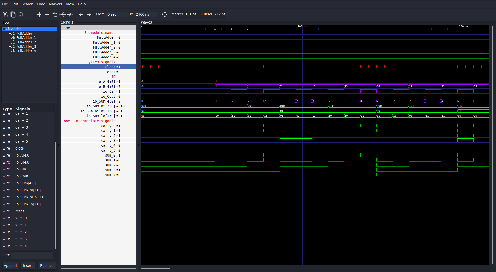
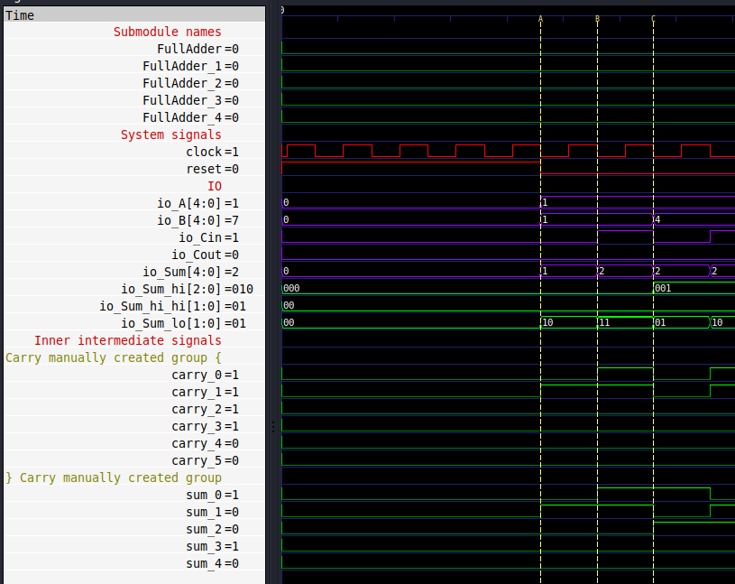
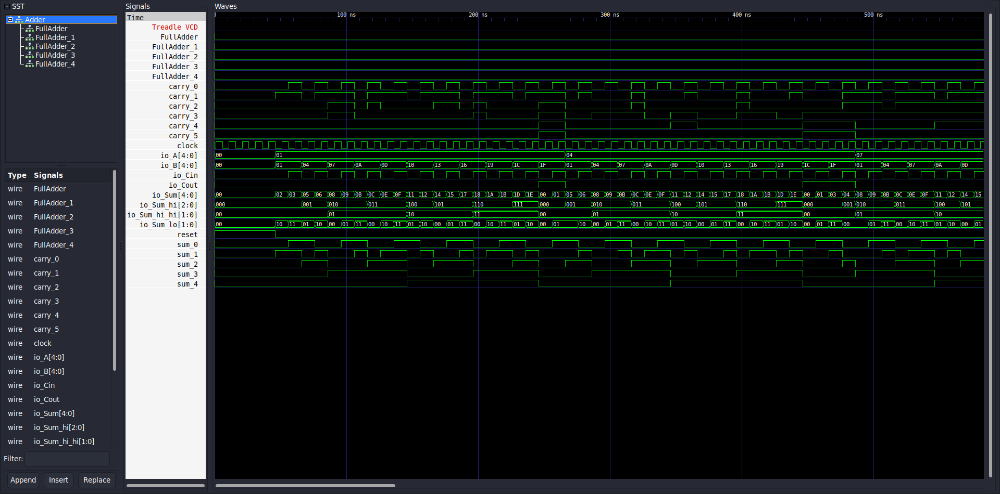
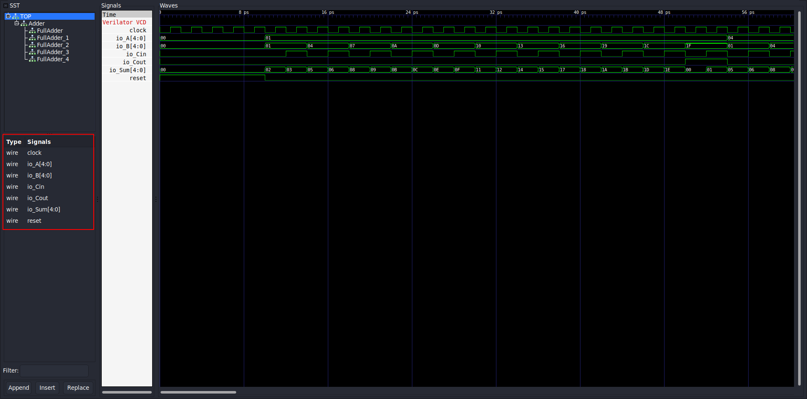
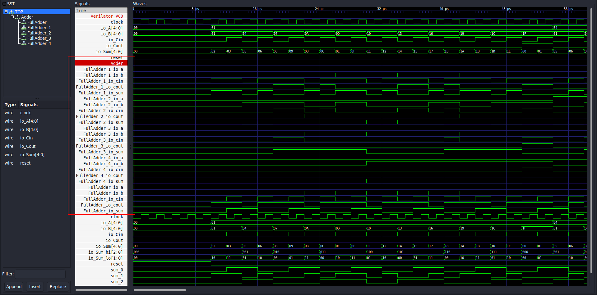
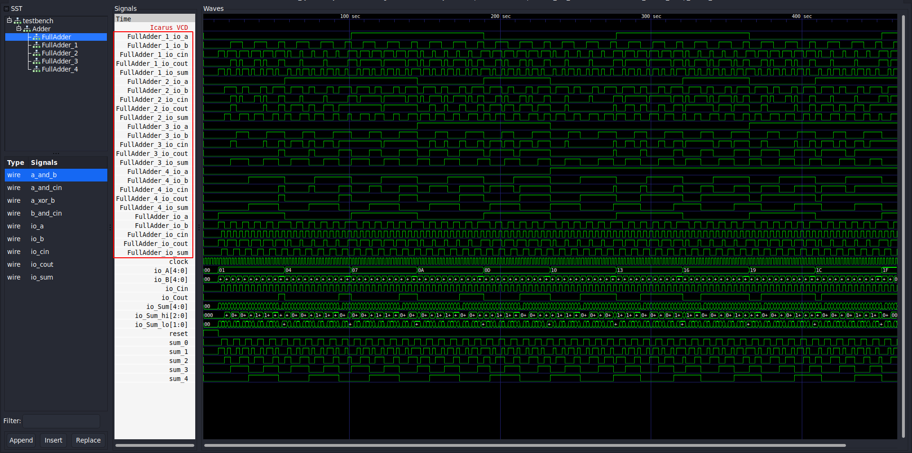
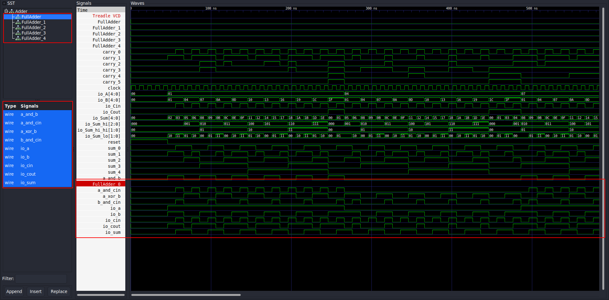
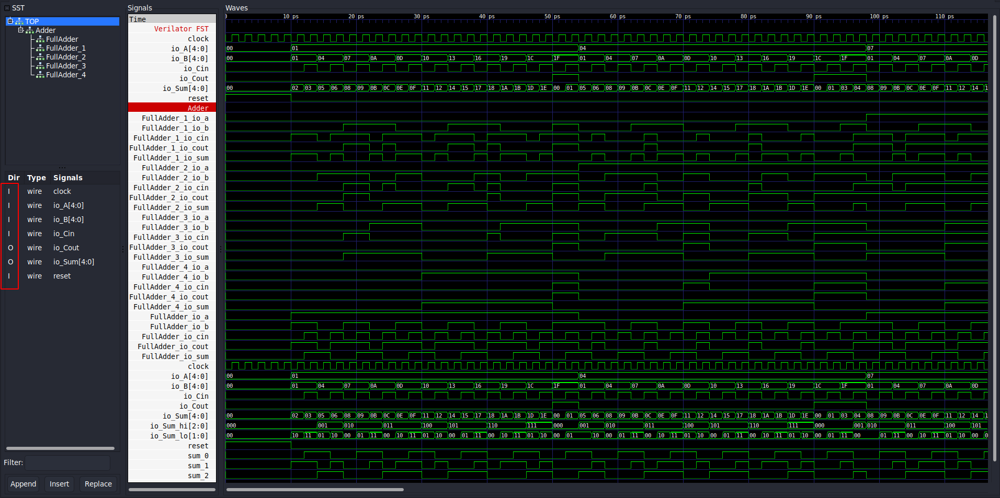
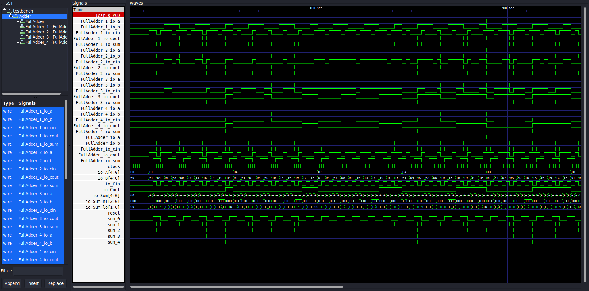
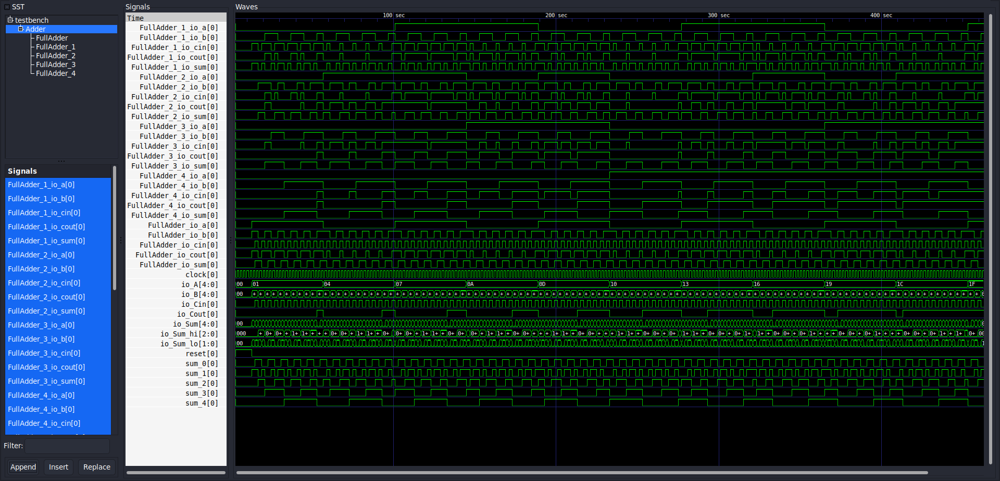

# An analysis of the waveforms produced by Chisel test benches
This [page](../chiseltest/) explored advantages and drawbacks of chiseltest[^1]. 
The framework allows to dump trace files (through `withAnnotations()`) that can be used by waveform viewers to inspect the signals of the circuit under test. 

```scala
  it should "dump VCD" in {
    test(new DUT())
      .withAnnotations(Seq(WriteVcdAnnotation)) { 
        dut =>
        // ...
      }
  }
```
Each simulator backend supports different trace formats. 
The following table shows these trace formats and the corresponding annotation name to be used in chiseltest. 
| Backend                                               | Supported trace output | Annotation                                                          |
| ----------------------------------------------------- | ---------------------- | ------------------------------------------------------------------- |
| [Treadle](https://github.com/chipsalliance/treadle)   | VCD                    | `WriteVcdAnnotation`                                                |
| [Verilator](https://github.com/chipsalliance/treadle) | VCD and FST            | `WriteVcdAnnotation` and `WriteFstAnnotation`                       |
| [iVerilog](https://steveicarus.github.io/iverilog/)   | VCD, FST and LXT       | `WriteVcdAnnotation`, `WriteFstAnnotation` and `WriteLxtAnnotation` |


This document explores first, in section [[1](#1-inspection-of-signas-from-waveform-viewers)], generic strenghts and weaknesses of viewers w.r.t. traces outputted by chiseltest. 
Then, a comparison of the produced trace formats is provided in section [[2](#2-difference-of-trace-formats)] and two widely used waveform viewers are compared in section [[3](#3-comparison-between-modelsim-and-gtkwave-for-chiseltest-dumped-files)].

> **Note:** The [analysis-by-example](../analysis-by-example/) reports a more detailed description of how chisel logi is represented in waveforms for each chosen [example](../../examples/).
> Therefore, it addresses specific representation weaknesses of the viewers on a case-by-case basis, trying to highlight the differences between the circuit code and the waveform representation.

## 1. Inspection of signals from waveform viewers
Waveform debugging is a common and widely used technique to inspect the signals of a circuit.
Existing waveform viewers can be used in conjuction with a simulation backend to capture and show signal transitions over time.

Compared to printf and assertion-based debugging scripts, waveform viewers offers several advantages. 
These advantages primarily revolve around improved visibility and debugging capabilities.

1. First of all, waveform viewers provide a **graphical representation** of signal levels. This visual aspect is crucial in understanding interactions within a circuit, which might not be as apparent in testbench scripts.
2. Secondly, multiple signals can be shown **together** and **compared over time**. This enables the identification correlations between signals, understanding how they interact with each other, and observing how their values change over time. This timing aspect becomes particularly relevant when developers seek to inspect performance metrics, such as number of cycles needed to complete a task, throughput, and signal delays.
3. Moreover, debugging complex hardware designs can be challenging either with printf or assertions, especially when dealing with large designs due too their complicated structure. Waveform viewers simplify this process by allowing to observe the behavior of signals and transactions in a **more digestible format**. As addressed [here](../chiseltest/), chisel testbench scripts obscure the inner workings of the simulated design. Waveform viewers provide a clearer picture of what is happening within the dut allowing to easily **access inner modules and signal** without any manual wrapping/expose of the dut. Furthermore, they can be used to select what signals to show, in what order, and how to format them (*however, it will be proved in this [page](../analysis-by-example/) that formats from current exisisting viewers are not well suited when dealing with complex data structure types of Chisel and, in particular, Tydi-Chisel projects where typed data is a key feature. This is because only basic numeric types are supported while Tydi can deal with complex nested structures*).
4. In addition to that, while testbench scripts can effectively be used, through assertions, to run automatic tests and check the correctness of the dut for specific conditions, waveform viewers can make the **troubleshooting process much faster**. By providing a visual context, they allow for a rapid identification of issues and understanding of their impact on the design.
5. Finally, waveform viewers, such as GTKWave, allow to put flags markers, change colors, and other useful features like adding comments to the waveform. This opportunity to take notes directly on the waveform is very useful to keep track of the debugging process and address the exact time of issues if needed. 
<!-- 5. Finally, they constitute the preferred option for hardware designs debugging. People are used to see waveforms and they are more intuitive than testbench scripts. -->

Fig. 1 shows a screenshot of GTKWave where example flag markers, colors, and comments are are applied to the [AdderTest.scala](../../examples/chisel-examples/src/chiseltest/AdderTest.scala) output. Specifically, as it can be seen from the figure, three yellow markers are placed to indicate 3 falling edges where the signal `io.Sum` changes. Colors are used to "group" signals of same type, i.e. io signals, reset and clock, and internal signals. Additionally, comments can be added to highlight the expected output of the dut and signal meanings.
Finally, the left panel shows the circuit hierarchy and the list of signals from the selected (sub)module that can be added to the wave panel.

GTKWave also offers a feature to group signals together as shown in fig. 2. This allows to obtain a more compact and clean view of signals, but this also requires manual intervention of the user which can be time consuming for large designs and it might lead to errors.
|                |  |
| --------------------------------------------------------------------------- | ---------------------------------------------------------------------- |
| Fig. 1 - *GTKWave sample output with flags, colors and comments inspection* | Fig. 2 - *Grouping signals in GTKWave*                                 |

However, while dealing with modern HDLs, existing waveform viewers can be less effective due to the mismatch between the code and the waveform representation. Modern HDLs, such as Chisel, introduce a new level of abstration compared to classic HDLs (Verilog or VHDL). Yet, the employed trace formats are derived from low-level RTL simulations (treadle, verilator, icarus), thus leading to the loss of code abstraction.

In conclusion, while testbench scripts with assertions are valuable for automated testing and identifying specific conditions, waveform viewers provide a more holistic and intuitive way to understand and debug hardware designs. They are particularly advantageous in complex and dynamic design environments, offering enhanced visibility, and easier debugging. 
Nonetheless, despite these advantages, waveform viewers encounter a challenge in maintaining abstraction when dealing with modern Hardware Description Languages (HDLs) like Chisel. This issue arises from the mismatch between the code and the waveform representation, stemming from the trace formats obtained from low-level RTL simulation.
This [analysis by example](../analysis-by-example/) provides detailed insights into the specific issues that arise when waveform viewers are used in Chisel and Tydi-Chisel projects.

## 2. Difference of trace formats of the supported simulators
As mentioned earlier, each simulator backend supports different trace formats.
This section explores the differences between the trace formats outputted by the simulators supported by chiseltest: VCD, FST, and LXT.
However, traces of the same format can be different depending on the simulator backend.

> **Note:** The outputs reported in this section are obtained by running the `AdderWaveformTest` class in [AdderTest.scala](../../examples/chisel-examples/src/chiseltest/AdderTest.scala). The screenshots are taken from GTKWave and reports the signals of the top module under test, without any update of the default settings.

### 2.1. VCD
VCD[^3] (Value Change Dump) is a standard format for tracing signals in digital circuits. It is a text-based format that can be easily parsed and understood by humans. 

In the context of chiseltest, VCD is supported by all the open-source simulators: treadle, verilator, and icarus. Fig. 3, 4 and 5 show the VCD outputs of the three backends respectively. All the 3 outputs present both similarities, such as hierarchical modules, as they have the same trace format and differences as a consequence of the different backend simulators.
In particular, the treadle VCD output (fig. 3) is the most compact as the IO signals of nested module are "dropped" in the top module signal domain, leading to a compact output. Figures 4.2 and 5 highlights that verilator and icarus VCD files dump a more verbose since also the signals of internal `FullAdder`s are reported in the top module domain. Fig. 6 shows that the also treadle can access those values by appending the signals of nested `FullAdder` modules. Similarly, also verilator and icarus VCD outputs can access nested modules, thus the verbose output in fig. 4.2 and 5 does not offer any additional information.
Moreover, Verilator seems to produce a slightly more organized output than the other backends, as it moves the IO signals of the top module inside the `TOP` tab (fig. 4.1) while treadle and icarus keep them in the `Adder` tab only (fig. 3 and 5).
Finally, closer look at fig. 3 reveals another difference between treadle VCD output and the other backends. Treadle reports `carry_i` signals next to the `sum_i` signals while the other two display only the wires for the sum. This result is unexpected since in the Chisel code both carry and sum are declare as wires in the [Adder.scala](../../examples/chisel-examples/src/main/Adder.scala).

<!-- On the other hand, verilator (fig. 4.1) and icarus (fig. 5) outputs show the hierarchy of the modules. However, verilator output (fig. 4.1) is not complete as it does not show the signals of the nested module `Adder`. This is because verilator does not support nested modules. To obtain the complete output, the `--trace-structs` flag must be used (fig. 4.2). -->

|  |
| -------------------------------------------- |
| Fig. 3 - *Waveforms from Treadle VCD output* |

|  |  |
| -------------------------------------------------- | ------------------------------------------------------------------------------------- |
| Fig. 4.1 - *Waveforms from Verilator VCD output*   | Fig. 4.2 - *Waveforms from Verilator VCD output with complete nested output*          |

|       |
| --------------------------------------------------- |
| Fig. 5 - *Waveforms from Icarus Verilog VCD output* |


|   |
| ---------------------------------------------------------------------- |
| Fig. 6 - *Access internal sub-modules signals from Treadle VCD output* |

### 2.2. FST
FST (Fast Signal Tracing)[^4] is a binary format designed for tracing signals in digital circuits that is faster than VCD.

Only Verilator and Icarus are capable of emitting FST traces.
Fig. 7 and 8 depict the FST waveforms of the two backends, respectively, using the same testbench from the previous section.
The two outputs closely resemble VCD outputs since they originate from the same backend.

However, this format adds the direction of input/output ports of every module in the model, including both top-level and sub-modules. It's important to note that this information is only produced with Verilator and is not available with Icarus. Such information is not available in VCD format as it is not supported by the standard (section 21.7.2.1)[^3].

Additional distinctions are related to the file format and they are beyond the scope of this document. However, they are briefly mentioned here for completeness, and further details about FST are discussed in Appendix F of the GTKWave manual[^4].

|  |
| ------------------------------------------------ |
| Fig. 7 - *Waveforms from Verialtor FST output*   |

|       |
| --------------------------------------------------- |
| Fig. 8 - *Waveforms from Icarus Verilog FST output* |

### 2.3. LXT
LXT (InterLaced eXtensible Trace) is a binary format specificlly created for GTKWave[^4]. It is a compressed format that can be used to trace signals in digital circuits which has better processing perfomance than VCD.

Among the three backends, only Icarus is capable of emitting LXT traces from chiseltest.
After an inspection of the LXT output of the `AdderTest` (fig. 9), it can be noticed that its output is very similar to the VCD and FST outputs. Namely, this format does not add any information for signal visualization and/or representation.

|       |
| --------------------------------------------------- |
| Fig. 9 - *Waveforms from Icarus Verilog LXT output* |

## 3. Comparison between ModelSim and GTKWave for chiseltest dumped files

> **TODO**

# References
[^1]: The officially supported testing framework for Chisel and Chisel-related projects. [](https://github.com/ucb-bar/chiseltest)

[^2]: Why Do You Need a Simulator-Friendly Debug Tool for UVM Debug? [](https://community.cadence.com/cadence_blogs_8/b/fv/posts/why-do-you-need-a-simulator-friendly-debug-tool-for-uvm-debug)

[^3]: **“IEEE Standard for SystemVerilog–Unified Hardware Design, Specification, and Verification Language”**. In: *IEEE Std 1800-2017 (Revision of IEEE Std 1800-2012) (Feb. 2018)*, pp. 653–673. [](https://doi.org/10.1109/IEEESTD.2018.8299595)

[^4]: Anthony Bybell. **“Appendix F: Implementation of an Efficient Method for Digital Waveform Compression”**. In: *GTKWave 3.3 Wave Analyzer User’s Guide*. Nov. 14, 2020, pp. 137–145. [](https://gtkwave.sourceforge.net/gtkwave.pdf)